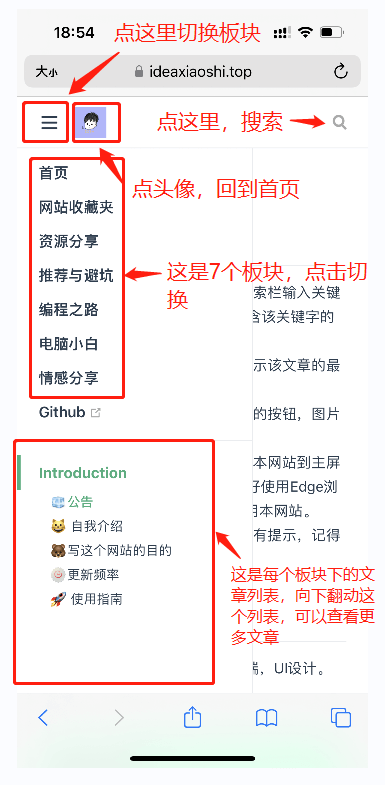
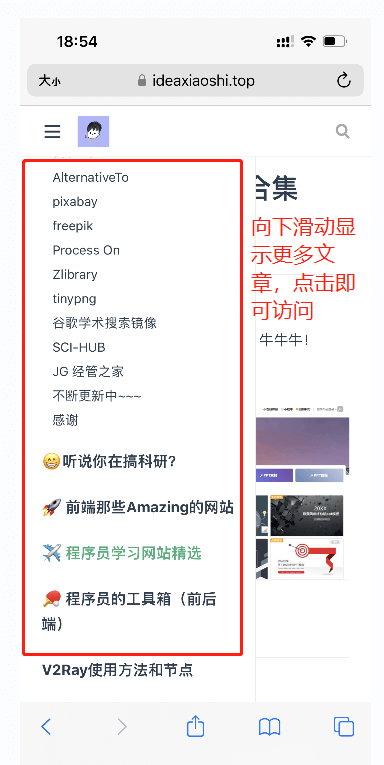
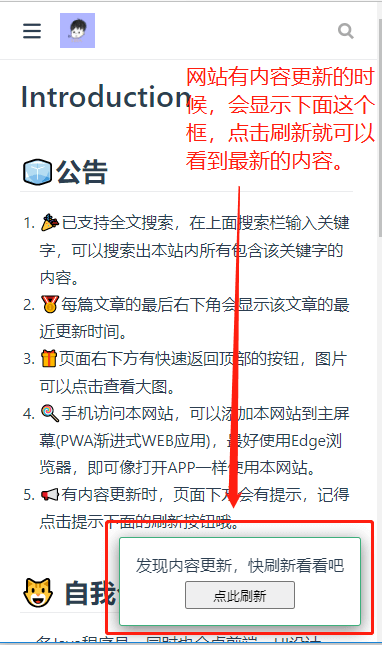
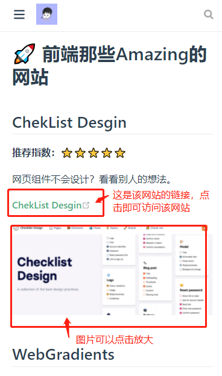
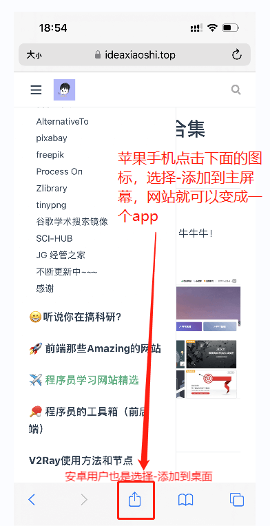

# Introduction

## :rocket:板块划分

点击**右上方导航栏**（手机端是左上角三条杠那个按钮）即可访问对应模块。

- 网站收藏夹：主要展示我平时收藏的一些好用的网站。

- 资源分享：主要有软件资源、游戏资源、电子书、图片等。

- 推荐与避坑：好物分享和避坑攻略。

- 编程之路：开发过程经验总结、学习日志、踩坑记录。
- 电脑小白：我的朋友们、发小们很多都是电脑小白，这里就用通俗的语言解释一些电子设备问题。
- 情感分享：随便讲讲。

## 🧊公告

1. 🎉已支持全文搜索，在上面搜索栏输入关键字，可以搜索出本站内所有包含该关键字的内容。
2. 🥇每篇文章的最后右下角会显示该文章的最近更新时间。
3. 🎁页面右下方有快速返回顶部的按钮，图片可以点击查看大图。
4. 🍭手机访问本网站，可以添加本网站到主屏幕(PWA渐进式WEB应用)，最好使用Edge浏览器，即可像打开APP一样使用本网站。
6. 📢有内容更新时，页面下方会有提示，记得点击提示下面的刷新按钮哦。

## 😎网站怎么用

第一次访问可能会很慢，因为用的国外的服务器。

只要访问过一次，以后就可以离线访问了，也就是没有网络也可以访问，你可以把网络关了，再访问试试。

网站内容如果更新了，就会在右下角提示你更新，点击更新。

## 🍎手机如何使用本网站？

## :smiley_cat: 自我介绍

一名Java程序员，同时也会点前端，UI设计。

爱好学习，喜欢看书。

## :bear:写这个网站的目的

总结、记录自己成长的点点滴滴。

也是帮助大家少踩坑。

## 🍥更新频率

**每周1~3次更新，多回来看看哦！**

