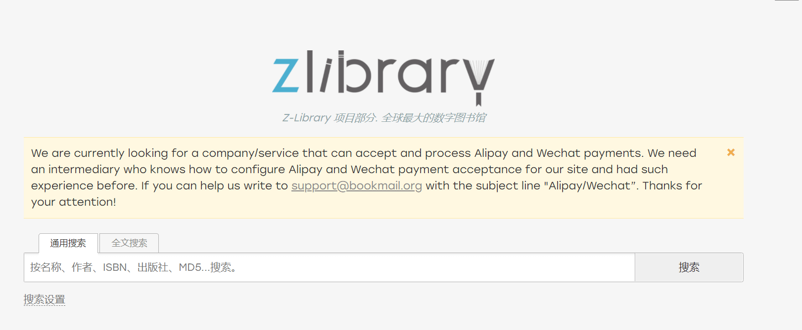

## 鸠摩搜书

**推荐指数：**:star::star::star::star::star:

国内网站，电子书大全，通常各种书籍都有。

各种格式都有。（pdf、mobi、azw3、equb)

[鸠摩搜书网站](https://www.jiumodiary.com/)

## Zlibrary

**推荐指数：**:star::star::star::star::star:

电子书大全，各种书籍都有。

各种格式都有。（pdf、mobi、azw3、equb)

真正的电子书神器。

每天有几次免费下载机会，登录后可以增加几次。

不要一天下载好多，没啥用，明天再下就是了。

我也会在我的网站的资源板块分享一些电子书，放在网盘里，敬请关注。

缺点：这个电子书网站的网址经常变动，因为访问的人太多了，如果网址不好使了，记得公众号联系我补链接。

[Zlibrary官网](https://zh.book4you.org/)

