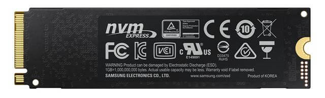
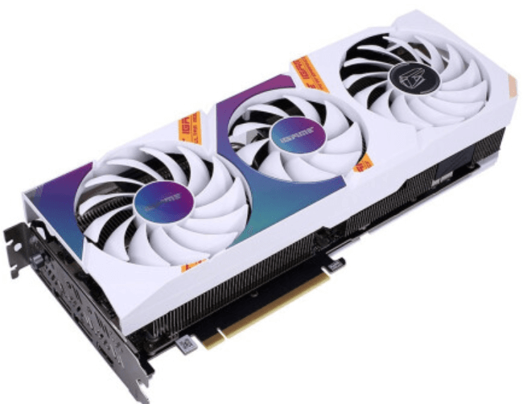

## 🌈选购参考标准

1. 外观：颜值即正义，好看最重要。:star::star::star::star::star:
2. 种类:  游戏本、轻薄本、普通本
3. 需求：明确自己都要用电脑来干什么，才能选配置。
4. 配置：至少有个大概了解，不能被人唬住。
5. 品牌：品牌很重要。:star::star::star::star::star:
6. 价格：与品牌、配置有关
7. 质量：与品牌密不可分。
8. 售后：与品牌密不可分。
9. 升级：看自己以后可能有的需求。

## 🧊外观

买电子产品，我一直认为外观是第一考虑因素，好看是最重要的😊，毕竟需要长时间使用，短期内应该不会更换。

关于外观，最好在网上找买家晒图，查看实际效果，有条件的到实体店、商场等等上手体验一下最好。

笔记本电脑的外壳材质也很重要，有的是合金（金属），有的则不是，具体看个人喜好选购。

## 🍭种类

### 游戏本

通常来讲，**游戏本的配置较高，散热好**:fire: :fire: :fire: ,流畅玩大型单机游戏，能够流畅运行多种大型软件，但是**体积较大，厚度大，重量**大约在2kg-3kg，并不适合经常带去出差、教室等。

### 轻薄游戏本

配置相比真正的游戏本低，散热稍差，流畅玩大型单机游戏等等，但是更轻便，**适用于办公兼轻度游戏玩家**，比较适合携带。

### 轻薄本

现在的轻薄本大多数都能做到**轻薄的同时，又能保证性能**，运行多种大型软件也不在话下。但是打大型游戏不行，LOL，CF这种随便玩。轻薄本的机身重量基本上在1-1.5kg，很轻薄了。适合没有太多游戏需求的人选购。

## 📘需求

电脑这种东西，很容易盲目跟风买。

你不一定需要那么高的配置，只是听说哪款很好就买哪款。

下面就列出了笔记本电脑的各种配置的区别。

## 🎉配置

### :coffee: 处理器（CPU）

> :bulb: CPU的好坏是电脑快慢的主要因素之一。

#### 核心数

CPU常见有4核8线程，6核12线程，8核16线程等。

**核心越多，能够同时运行的软件也多**，而且不卡。

普通办公4核8线程够用，学生党比较常用的是6核12线程，编程人员主要6核12线程或8核16线程，大型服务器才会有10核20线程。

#### CPU厂商

**CPU主要有两大厂商：Intel（英特尔）和AMD。**

早期英特尔性能比较强，现在AMD和英特尔不相上下，但**AMD比英特尔便宜很多，性价比很高**。

英特尔的处理器代表产品系列：酷睿i5，酷睿i7，酷睿i9等。

AMD的处理器代表产品系列：锐龙R5，锐龙R7，锐龙R9等。

每隔一年或半年，两家厂商都会发布新一代的处理器。

> :bulb:英特尔CPU在软件优化方面比AMD的要好，特别是PS、AE等Adobe软件公司的软件，英特尔还是比AMD强很多的。其他软件，比方说编程方面，二者差别很小。

#### CPU型号各个字符的含义

例如：酷睿i5的11代处理器**i5-1155G7**，锐龙R7的第5代处理器**R7-5800H**

横杠后面的**第一个数字**表示是第几代，这个很重要，新一代的处理器往往能吊打上一代的处理器。

酷睿i5的11代处理器肯定是吊打第10代的。

锐龙R7的第5代处理器肯定是吊打第4代的。

但是酷睿i5的11代处理器和锐龙R7的第5代处理器不能通过代数来比较，只是酷睿系列出的代数比较多而已，并不是说酷睿就比锐龙先进了好几代，这两个代数没有任何关系。举个例子：小米10和苹果13，10和13这两个数字没有可比性，因为是不同厂商的产品。

#### CPU主频

CPU还有个重要参数就是主频，也叫睿频，单位是GHZ，通常你会看到4.8GHZ，5.0GHZ等字样。

> :bulb: 主频，决定了CPU的单核性能，当然也是越高越好，大家可以不必关心这个，只要知道这是个什么东西就行。

**游戏玩家可以关注下这个主频**，因为游戏画面流畅（帧数高），除了看显卡的好坏以外，还看CPU单核的性能，主频越高越好，而多核心多线程对于游戏来讲影响几乎为0，因为用不到多核心，通常是单核心在工作。

#### CPU电压

**CPU还分标压，低压**。CPU型号的最后一个英文字符代表电压大小，例如锐龙R7的第5代处理器**R7-5800H**，这个H就是标压的意思，U通常代表低压。说的就是CPU的电压大小，电压越大，性能越高。标压是最高的，低压是为了照顾电池续航，减少功耗，而降低了性能的，**低压CPU俗称“残血版”CPU。标压CPU俗称“满血版CPU”**。显卡的残血满血也是这个意思。通常残血的要比满血的低个20%-30%左右的性能，轻办公选低压，正常选购就标压即可。

#### CPU性能天梯图

如果想对某台电脑的CPU的性能有更好的了解，**可以去“知乎”搜索“笔记本CPU天梯图”**，从图中找到该CPU所处的位置，就可以知道它的大致性能，可以与其他CPU进行比较。通常来讲，大多数人只需要在天梯图的中部靠上部分就完全足够用了。

### 🍕内存

> :bulb:内存决定了你能同时运行多少软件。
>

#### 内存大小

现在的笔记本很少有8G内存的，通常是16G起步。

对于大多数人，**16G是当前最好的选择**，至少能用个三四年。

如果基本上就是看电影，刷网页，那就8G没问题。

如果有大型影片剪辑的，可以尝试32G内存，但不是很有必要。

#### 内存频率

内存类型现在通常都是DDR4类型的，频率在3200mhz，打游戏绝对够用了。DDR5也出了，不过暂时价格昂贵，没有必要买DDR5。

内存频率决定了内存读写的快慢，**直观感受就是加载速度的快慢**。

**这种加载速度的快慢通常体现在游戏的加载、大型软件的加载以及开机速度上。**

没有特别需求，3200以下的频率可以选择。

#### 扩展性

有的笔记本的内存是**板载内存**，是直接焊接在主板上的，更换不了，也就是说一辈子只能是这么大的内存，16G就一直是16G，不能手动安装新内存条给他升级到32G。**想升级内存大小，只能换台新电脑**。

**而正常来讲，都不是板载内存**，都可以后续自己**买内存条升级**，也可以去官方售后直接在那买内存条，当场给你换上。

是不是板载内存，具体可以咨询下客服，或者商品详情页都有说明，能否升级内存。

### 🍔硬盘

> :bulb:硬盘主要分为固态硬盘和机械硬盘。
>

> **固态硬盘**是新型硬盘，读取和写入的速度都非常快，**直接体现在软件、游戏的打开速度以及开机速度上**，机械硬盘是老式硬盘，如果说机械硬盘是自行车的速度，那么固态硬盘就是飞机火箭一类的。

在固态硬盘刚开始流行的时候，是比较贵的，所以人们都买一块小容量的固态硬盘用来放操作系统，能够实现6秒内的快速开机。不过现在固态已经很便宜了，白菜价格，所以固态容量就上去了。

机械硬盘的速度是很慢的，现在很少有笔记本装机械硬盘，通常游戏本才可能会有机械硬盘，因为现在固态硬盘的价格很便宜，一般m2类型的固态硬盘500g在200-300块，1TB（1000G）的固态也就500-600元。

现在卖的笔记本的硬盘容量都是512G起步，少数256G（比方说苹果的macbook），不出意外的话，大多数人都够用了。

有大容量需求的可以自己再买块移动硬盘，价格大约在1T 100-200元，很便宜。

#### 硬盘寿命

:question: 有人可能会问，为什么固态硬盘这么好，为什么没有完全替代掉机械硬盘，机械硬盘这么菜，还在卖？

:white_check_mark: 原因：**固态硬盘的寿命比机械硬盘短**。

**固态硬盘的寿命是按照写入量来计算的**，当写入量达到最大值，固态硬盘就报废了。

**但正常使用，用个几十年还是没问题的。**

机械硬盘的寿命就无限了，基本上你不乱摔它，它就一直好用。

#### 扩展性

说到扩展性，有的笔记本内部预留了**m2类型的固态硬盘安装位置**，你可以后续自己买硬盘找售后免费加装固态硬盘，也可以去官方售后直接在那买固态硬盘，当场给你换上。有的则没有预留固态硬盘位置，要想升级大硬盘，就只能换掉原来的固态硬盘。

**能否加装固态硬盘**，具体可以咨询下客服，或者商品详情页都有说明。

### 🍉屏幕（显示器）

### 屏幕尺寸

市场上的尺寸有13.3英寸、14英寸、15.6英寸、16.1英寸、17英寸等。

普通需求就选14、15.6的。

有打游戏的需求的推荐15.6及以上。

经常外带的，14最好，15.6也可以，超过15.6就不适合外带了。

13.3主要是轻办公，经常看剧的可以买，毕竟屏幕太小了。

> :bulb:当然屏幕尺寸和实际显示大小还是不一样的，这个体现在屏占比上。

#### 屏占比

屏占比：显示区域占电脑屏幕的百分比。

**屏占比高的，边框很窄**，因此，即使屏幕是16英寸的，机身实际上的大小和普通屏占比的15.6英寸的没什么差别。而且，屏占比高，看着很爽，就跟手机的屏幕的屏占比一个道理。

### 屏幕分辨率

分辨率越高越高，屏幕的细腻程度越高，看到的东西就越清楚，入门级别的分辨率是1080p（1920*1080），高级的是2k，2.2k，2.5k，甚至是4k。

普通人2k最好，1080p也不是不行。2k相当于2倍的1080p（实际上也就1.5倍左右），4k实实在在的是1080p的4倍，但是没有必要。除非你做设计师等职业需要这么高的分辨率。

### 屏幕色域

屏幕所能显示的色彩个数的最大范围，色域越广，能显示的颜色越多，越细腻。

通常这类参数有sRGB 100%，DCI-P3 90%等，**后面的百分数自然是越大越好**，对于这些参数，只需要知道，有的话最好，没有的话也不是不行。设计师除外，设计师必须选择高色域的，要求色彩准确。

### 刷新率

刷新率是指屏幕一秒钟能够刷新多少次。入门级别就是60hz，一秒钟刷新60次，普通人已经够用了。

市场上通常有60hz，75hz，120hz，144hz，165hz等。没宣传屏幕刷新率的，就是默认的60hz。

120hz及以上比较适合电竞玩家，因为玩FPS第一人称射击游戏，帧数高能够更快的看到敌人，游戏体验更好。但是60hz又不是不能玩。

### 屏幕比例

传统的是16:9，就挺正常的。

新出的是16:10，能比16:9的屏幕多显示两行内容。

这个比例是指：显示器的长度和宽度之比，16:10比16:9更宽，所以能多显示两行内容。

其实无所谓，编程多看几行代码而已。其他人没什么太大影响。

### 低蓝光认证

有的话最好，蓝光少很多，保护眼睛。

没有也不是很重要。

### 亮度

> :bulb:亮度是很重要的。
>

如果笔记本电脑的亮度在300nit以下，那就别买了，很垃圾了。

300nit在室内正常可以用，室外有阳光时根本看不清屏幕上的东西。

400nit以上最好。

参考手机的亮度：现在手机的最高亮度通常可以达到800nit以上。

### 🍏显卡

#### 显卡厂商

显卡也是主要有两个厂家，**英伟达（*NVIDIA*）和AMD**。

两家同价位产品在**游戏性能方面差不多**，AMD更便宜，两者渲染出来的游戏画面没有区别，只是在色彩上面会有所不同，只是设置的不一样，可以更改的。

但是在其他领域，比方说**机器学习、GPU加速、大型软件方面**，**还是要选择英伟达**，AMD这方面不太行。

#### 显卡型号

**英伟达显卡分为GTX，RTX系列**，分别定位中高端。

RTX系列支持光线追踪，光线追踪能让游戏画面更真实，更好，GTX系列则不支持光线追踪。

GTX代表产品1650，1060，RTX 代表产品2060、3060 、3070等。**数字越大，性能越好，因为不同数字是不同的产品，定位不同**。

后面带Ti字的，是加强版，比方说3070ti是3070的加强版，通常大约加强20%-30%。

想知道显卡的具体性能排行，**可以去“知乎”搜索“显卡天梯图”。**想知道什么显卡能玩什么游戏，可以去B站搜显卡游戏测评。

显卡性能主要看cuda计算单元的个数多少，越多表示性能越高。再就是看显存大小，如果屏幕分辨率高，但是显存小，则开不了高分辨率下的高画质，只能中等画质。或者降低分辨率，才能使用高画质。所以说显存大小和画质直接挂钩，因为画质和分辨率过高会超过显存容量。

#### 显卡类型

**显卡按类型还分为核显和独显**，核显是嵌在CPU里的，独显叫独立显卡，是单独插在主板上的。核显性能低，独显性能高，两者的性能通常不是一个层次上的。

**打大型单机游戏，3A大作必选独显，打LOL、CF、DNF这种核显就足够了。**

如果商品详情没说独立显卡，那就是核显。

### 🍸接口

我们常用的接口有

**USB**：插U盘、鼠标、键盘等

**type-c**：手机快充、数据传输

**网线口**：插网线

**HDMI接口**：外接显示器

**耳机接口**：插耳机

> :bulb:接口个数一定要关注，在商品详情页的产品图都有。
>

如果觉得接口不够用，果断不要这个笔记本，或者自己可以买扩展坞外接在这个笔记本上。

比方说：USB接口只有一个，插一个鼠标就不能再插U盘了。

没有网线接口，只能用无线，或者买扩展坞。

没有HDMI接口不能外接显示器等。

### 🧂键盘手感

键盘手感也是一个重要的选购理由。

通常来讲，键程长的键盘手感好。键程就是按下去的深度，因为机械键盘都是键程很长，按下去的反馈感很好，打字很爽快。

笔记本中键盘手感比较好的，当属联想的ThinkPad。

### 🍥其他

1. 电源适配器大小、重量、瓦数（最大功率，并不是实时功率，不要担心功耗很高，只有在电脑高负荷运转的时候才会达到这个功耗）。电源的瓦数是指能够提供的最大功率，如果功率供不上，就可能烧主板，不过这种问题不需要担心，基本不可能烧主板。
2. 性能释放瓦数越大越好，性能越强。
3. 无限网卡性能（联发科的挺垃圾）

## 🍇品牌

> :bulb:品牌很重要。

:green_heart: 一线品牌：联想（Lenovo）、戴尔（DELL）、惠普（HP）、华硕（ASUS）、苹果（Apple）、华为（HUAWEI）、外星人

:yellow_heart: 二线品牌：机械革命、神舟、宏碁（acer）、雷神、小米

:black_heart: 三线品牌：机械师、火影

普通人买联想等大厂即可。略懂电脑的可以尝试机械革命，品质不错，而且性价比高，扩展性强。

## 🍓价格

上网、看剧、编写文档：3500以下的价格即可。

普通大学生：4500-5000即可，大学4年没有问题。

专业有要求大学生（编程、PS、AE、制图）：5000-6500.

普通网游（LOL）：5000左右。

大型游戏，FPS，3A大作：5500以上。

## 🌴质量

品牌=质量。参考品牌的等级。

## 🍊售后

电脑的售后还是很重要的，毕竟笔记本自行修理的难度还是很高的，如果除了问题，当地都没个售后可以修的话就很难受。

只有快递进行售后的话很麻烦，还不放心。

> :bulb:大品牌在各个城市都有很多售后维修点，这一点就是买品牌的重要性，能省很多事。毕竟大多数人不懂电脑。
>

## 🍋升级

就是我说的扩展性，有的笔记本有预留硬盘位，可以再加一块硬盘，有的就没有。

有的内存条是板载的，不能进行升级。

有的轻薄本支持氮化镓充气器快充，有的就不支持，后续就只能用原装的很重的充电器，而不能换成很轻、很小的氮化镓充电器。

## 不断更新中~~~

会持续更新的，记得多回来看看。

## 感谢

感谢每一位小伙伴的支持，感谢每一颗❤️。觉得有帮助，请点赞转发关注支持一下！

有任何疑问都可以留言公众号（idea小时），看到消息我会第一时间回复。对于问的多的问题，我会出文章解答的！

