# :rocket: 前端那些Amazing的网站

## ChekList  Desgin

**推荐指数：:star:**:star::star::star::star:

网页组件不会设计？看看别人的想法。

[ChekList  Desgin](https://www.checklist.design/)

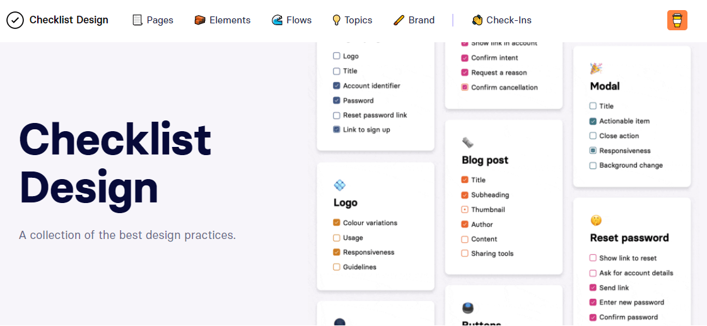

## WebGradients

**推荐指数：:star:**:star::star::star:

[WebGradients](https://webgradients.com/)

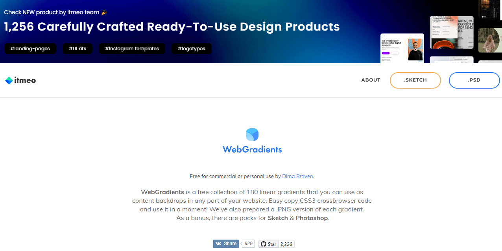

## Webframe

**推荐指数：:star:**:star::star::star::star:

各种页面的UI设计收集，提高自己的审美。

[Webframe](https://webframe.xyz/)

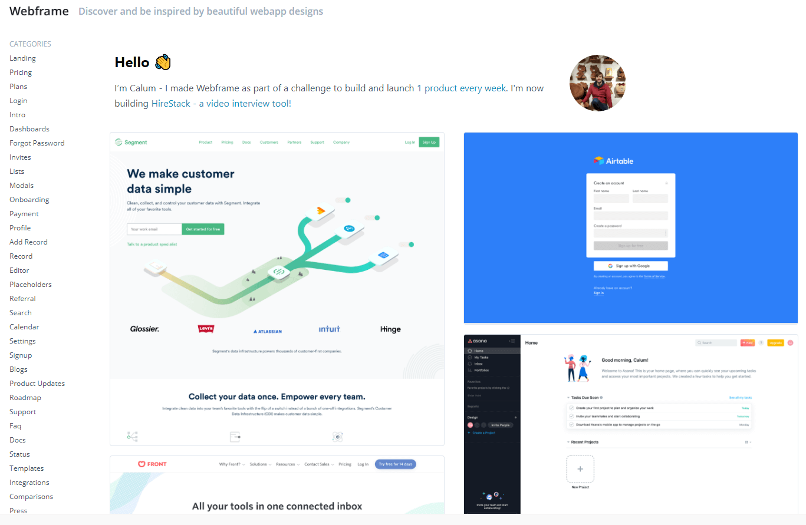

## Spline

**推荐指数：:star:**:star::star::star:

3D UI设计。UI设计师专用。

[Spline](https://spline.design/)

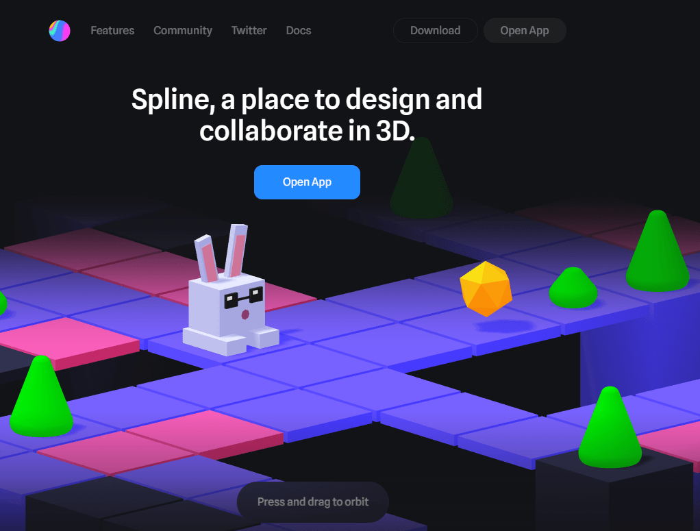

## typeanything

**推荐指数：:star:**:star::star::star::star:

在线进行字体的选用、属性组合、设计、预览、CSS代码生成。

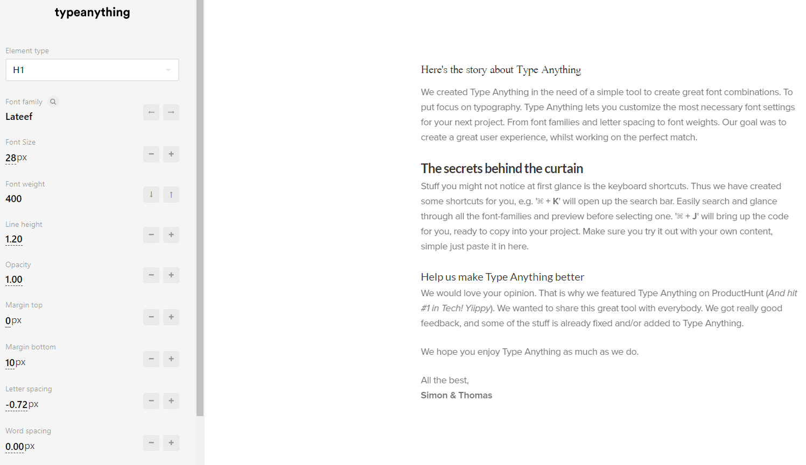

## animista

**推荐指数：:star:**:star::star::star:

在线练习、生成CSS动画。

[animista](https://animista.net/)

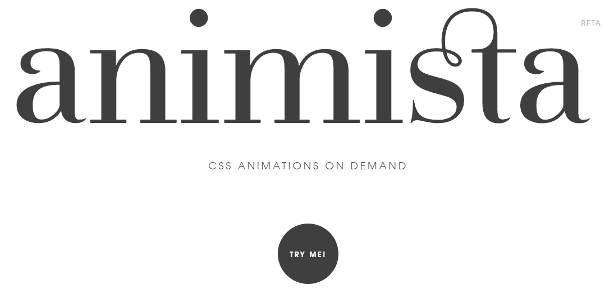

## Laws of UX

**推荐指数：:star:**:star::star::star:

大神总结的UI设计规则，除了界面有点丑、全英文以外，没啥缺点。

[Laws of UX](https://lawsofux.com/)

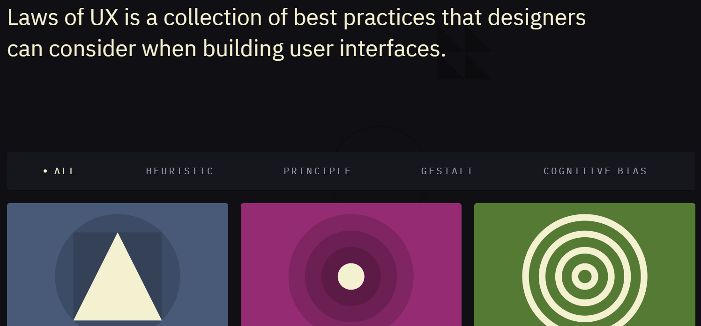

以上内容更新时间：2022年3月14日10:50:48

## Dribbble

**推荐指数：:star:**:star::star::star::star:

各种设计师大神在上面分享自己的作品，可以在上面学习大神们的设计美学，运用到自己的项目中。

[Dribbble官网](https://dribbble.com/)

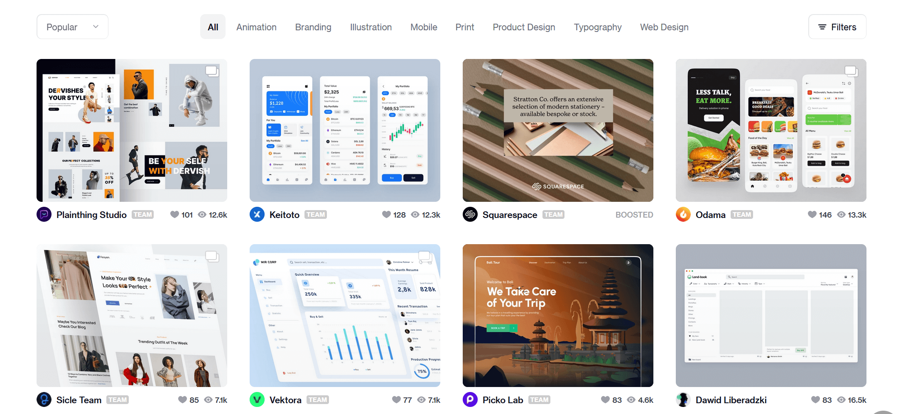

## ElementUI

**推荐指数：**:star::star::star::star::star:

饿了么前端团队出品的一款前端UI组件，Vue开发必备神器。好看，好用。

[ElementUI中文官网](https://element.eleme.cn/#/zh-CN)

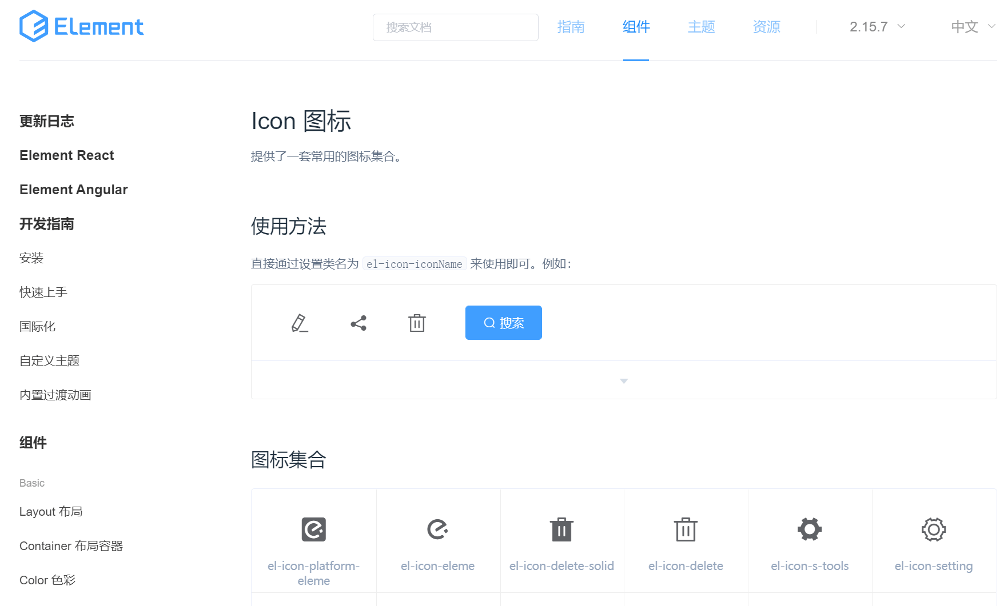

## tailwindcss

**推荐指数：:star:**:star::star::star:

非常精美的UI组件库。不过我只用来学习UI设计，查找资源。

[tailwindcss官网](https://www.tailwindcss.cn/resources)

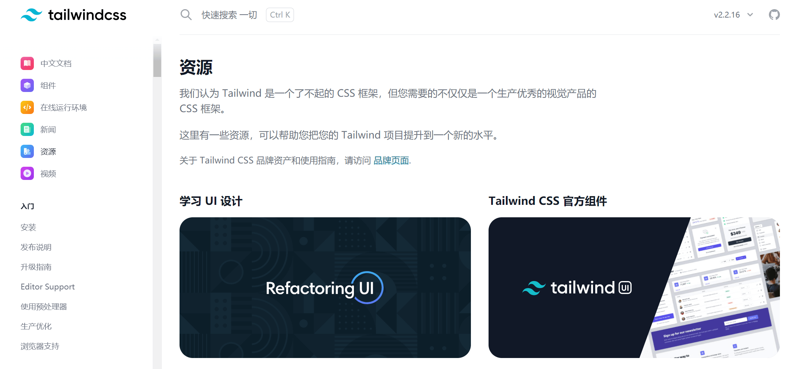

## Animate.css

**推荐指数：**:star::star::star::star::star:

大名鼎鼎的Animate.css，有非常优秀全面的动画效果，简单易用到几个类名就能让你的界面活起来。

[Animate官网](https://animate.style/)

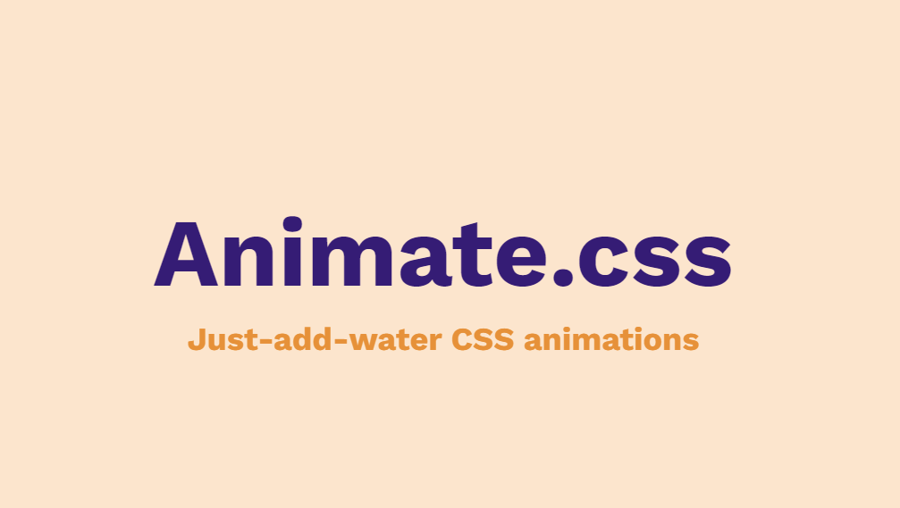

## MDN Web Docs

**推荐指数：**:star::star::star::star::star:

学习HTML、CSS、JavaScript的神级网站，FireFox贡献的学习文档，在这上面学习能让你的前端基础更牢固。

[MDN Web Docs中文官网](https://developer.mozilla.org/zh-CN/docs/Web)

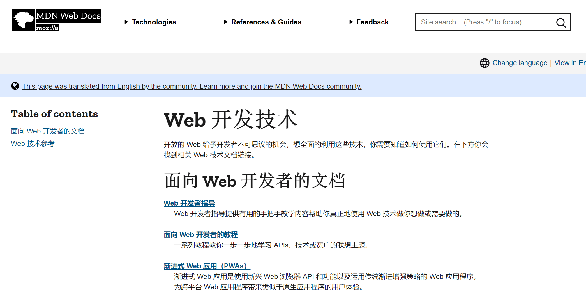

## Neumorphism.io(新拟态设计)

**推荐指数：**:star::star::star::star::star:

今年非常流行的新拟态设计，可以copy它的css代码，给你的网页组件加上新拟态的设计。

[Neumorphism.io(新拟态设计)](https://neumorphism.io/#ffffff)

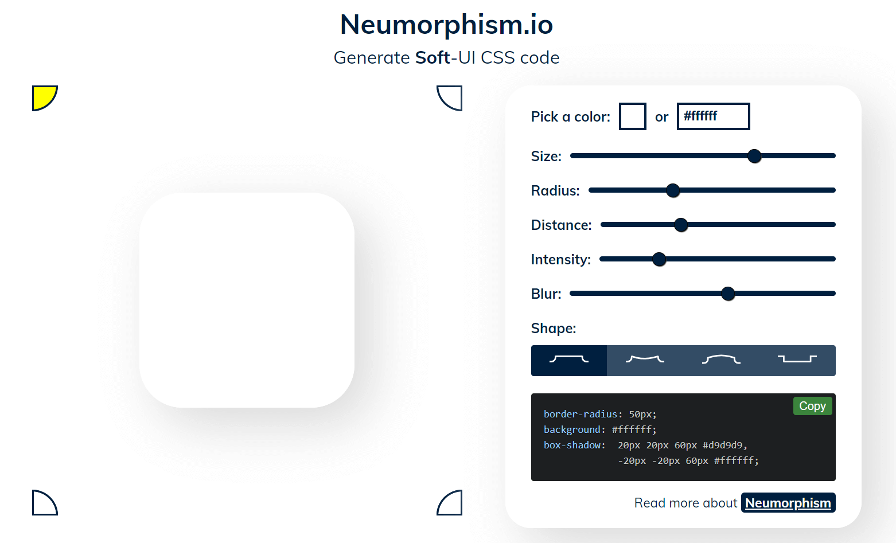

## Apache ECharts

**推荐指数：**:star::star::star::star::star:

一个基于 JavaScript 的开源可视化图表库

还在羡慕别人高端大气上档次的柱状图、曲线图吗？

还在苦苦寻找一个数据统计可视化的模版吗？

有了它，你的数据展示立马就人上人。可惜，配置有点麻烦，配置参数有点多，不过这很正常，毕竟这种东西细节处理要认真对待。

[Apache ECharts中文官网](https://echarts.apache.org/zh/index.html)

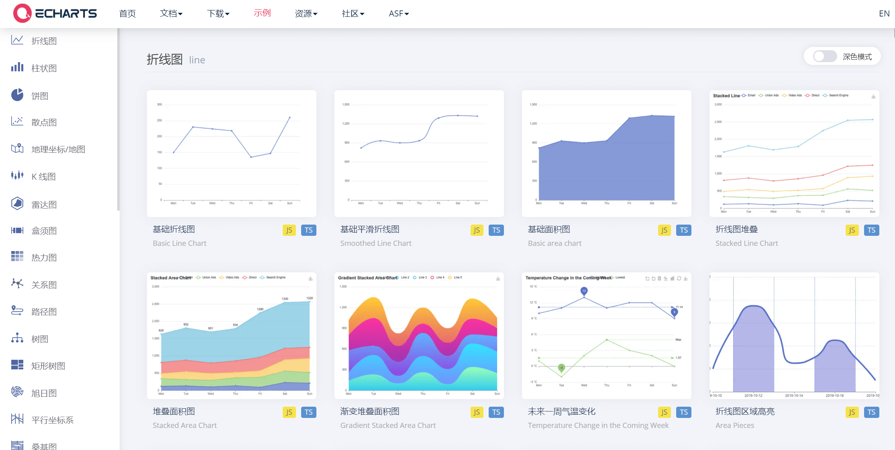

## tui.editor（富文本编辑器）

**推荐指数：**:star::star::star::star:

别人的网页都能像word那样编辑文本框，但是你的网页只能输入简单的文字，这是为什么呢？因为你缺少一个富文本编辑器，用这个可以让你的网页能够保存和显示更丰富的内容。

[tui.editor的Github地址](https://github.com/nhn/tui.editor)

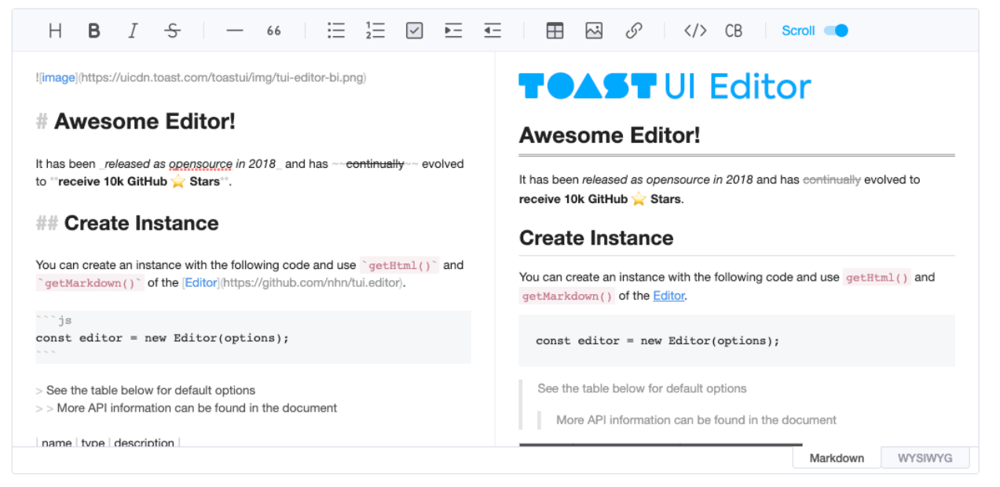

## vue-element-admin（后台管理网站的前端模版）

**推荐指数：**:star::star::star::star:

后端人员对于前端的了解很少，如何才能快速搭建一个后台管理网站呢？用这个就没错，好用的一批。

[vue-element-admin官方演示地址](https://panjiachen.github.io/vue-element-admin/)

[vue-element-admin的Github地址](https://github.com/PanJiaChen/vue-element-admin/)

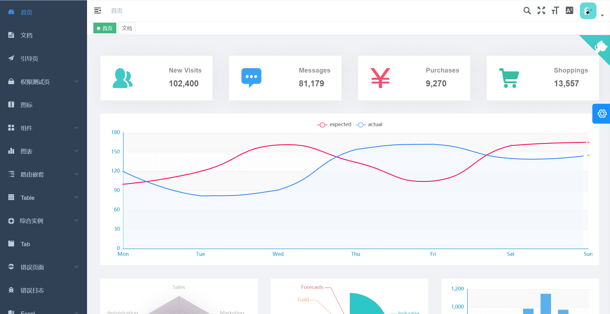

## ionic（跨平台移动APP制作）

**推荐指数**：:star::star::star::star:

有朋友可能有兴趣自己做个app，但是只会HTML、CSS、JS，不懂安卓和IOS开发，可以试下这个。

缺点：没中文翻译。

[ionic官网](https://ionicframework.com/docs/)

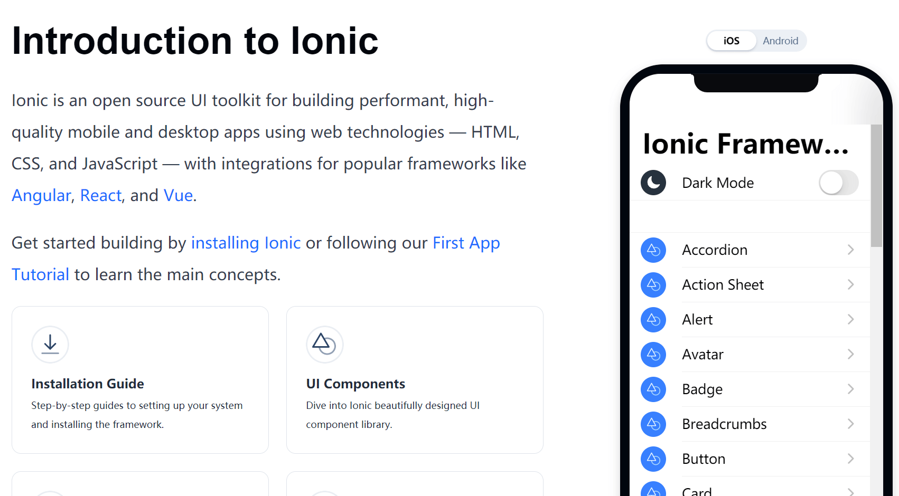

## Electron（跨平台桌面应用开发）

**推荐指数：**:star::star::star::star::star:

上面说了移动端的跨平台开发，这里就说下桌面平台应用的开发。

如果想开发桌面应用，又不懂C++，只会前端那些技术，可以试下这个框架。

大名鼎鼎的VS Code代码编辑器就是用它开发的。还有很多你用过的软件都是用它开发的。

[Electron官网](https://www.electronjs.org/)

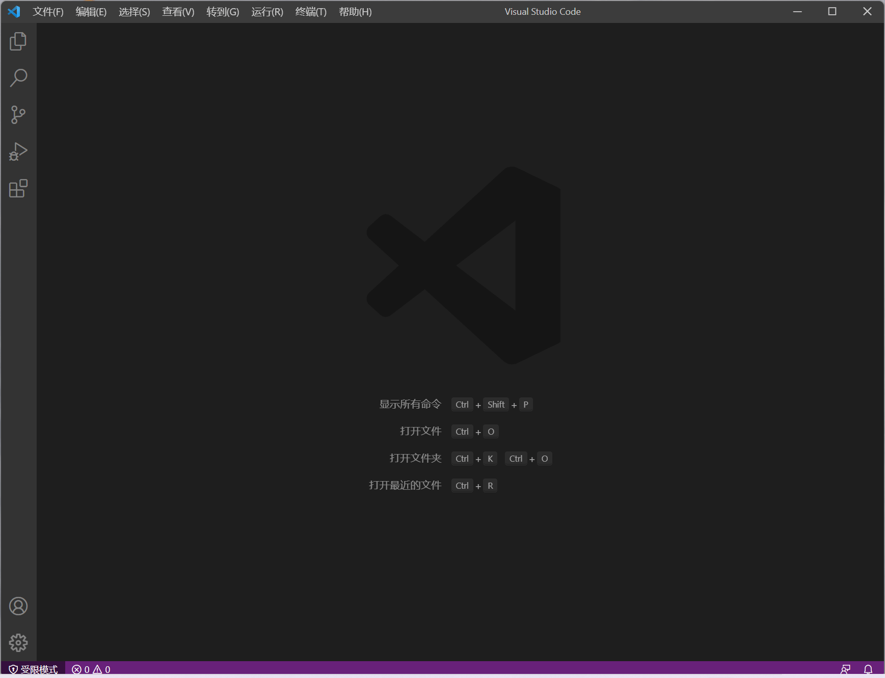

## Google Fonts

**推荐指数：**:star::star::star::star::star:

网页字体也是网页设计的一部分，好的网站字体都很好看。

用Google的超全的字体库能让你的网页上升一个档次。

注意版权问题哦！

[Google Fonts中文网站](http://www.googlefonts.cn/)

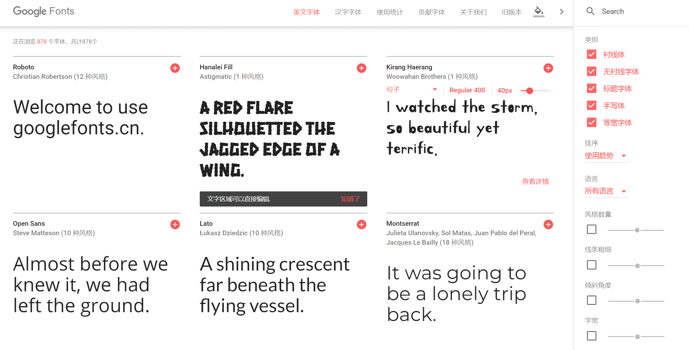

## Shape Divider

**推荐指数：**:star::star::star::star::star:

生成好看的形状背景。

[Shape Divider](https://www.shapedivider.app/)

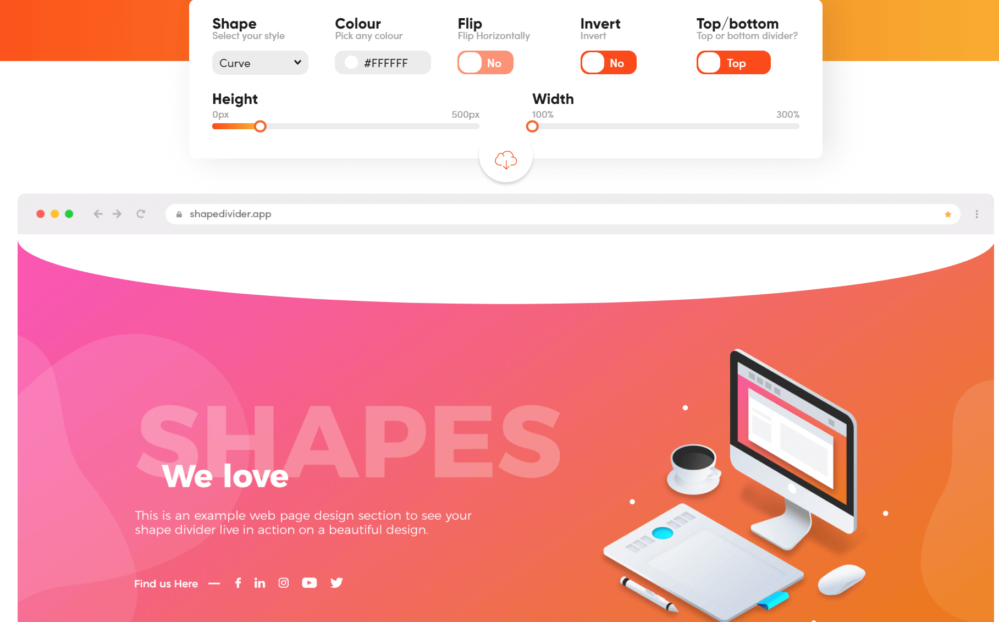

## Uigradients

**推荐指数：**:star::star::star::star::star:

渐变色神器。

[Uigradients](https://uigradients.com/)

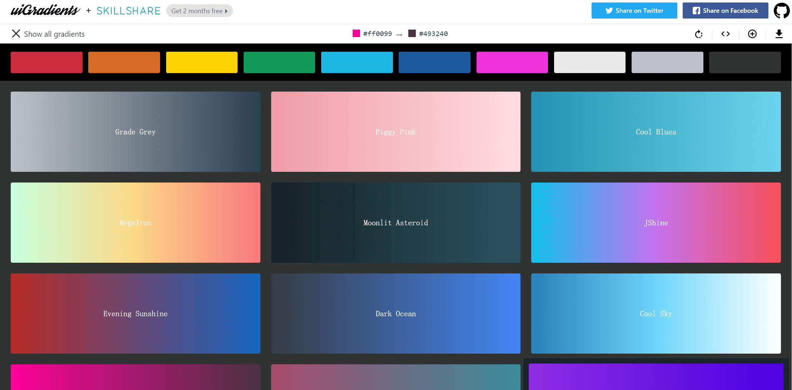

## 不断更新中~~~

会持续更新的，记得多回来看看。

## 感谢

感谢每一位小伙伴的支持，感谢每一颗❤️。觉得有帮助，请点赞转发关注支持一下！

有任何疑问都可以留言公众号（idea小时），看到消息我会第一时间回复。对于问的多的问题，我会出文章解答的！

