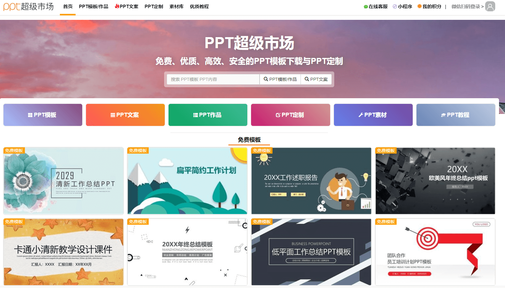
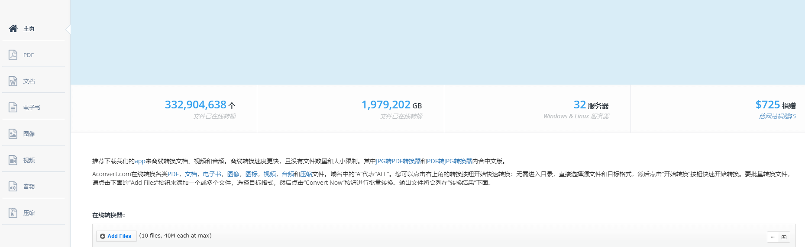
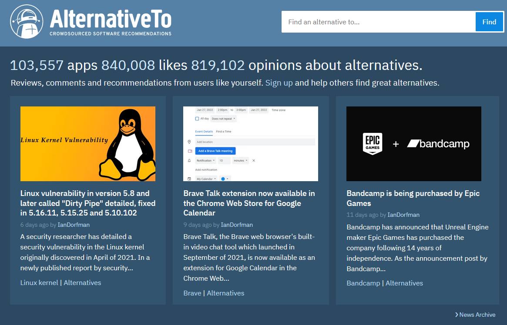
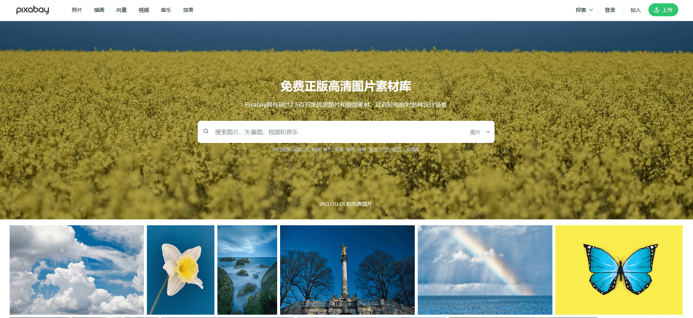
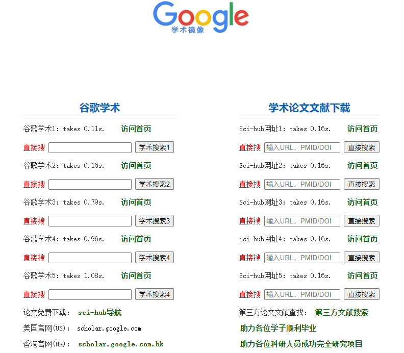
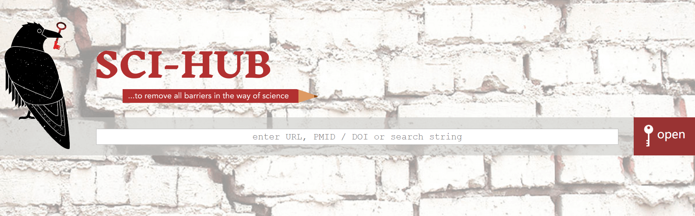
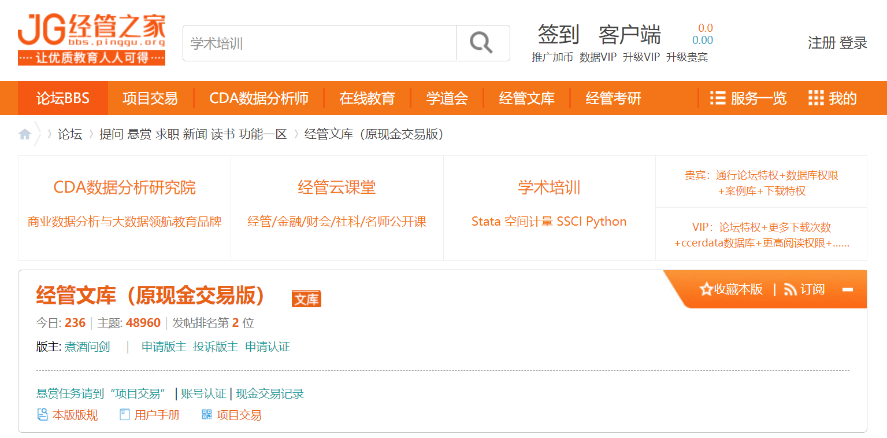

# :man_student: 学生必备网站合集

## PPT超级市场

**推荐指数：:star:**:star::star::star::star:

完全免费的PPT模版，好看好用。牛牛牛！

[PPT超级市场](https://www.pptsupermarket.com/)

## aconvert

**推荐指数：:star:**:star::star::star::star:

各种文件格式在线转换，完全免费。

Aconvert.com在线转换各类[PDF](https://www.aconvert.com/cn/pdf/)，[文档](https://www.aconvert.com/cn/document/)，[电子书](https://www.aconvert.com/cn/ebook/)，[图像](https://www.aconvert.com/cn/image/)，[图标](https://www.aconvert.com/cn/icon/)，[视频](https://www.aconvert.com/cn/video/)，[音频](https://www.aconvert.com/cn/audio/)和[压缩](https://www.aconvert.com/cn/archive/)文件。

页面有中文版的，右上角导数第二个选项切换语言。

[aconvert](https://www.aconvert.com/cn/)

## AlternativeTo

**推荐指数：:star:**:star::star::star::star:

看这个名字应该就应该知道了，这个网站是专门为你推荐替代品的。

比方说某个软件很好用，但是收费，你可以在这个网站上搜索这个软件的替代品，只需要输入这个软件的名字即可。

牛的一批。

[AlternativeTo](https://alternativeto.net/)

## pixabay

**推荐指数：:star:**:star::star::star::star:

想找图片？百度上的乱七八糟，还带水印？

这个网站提供免费的高质量图片。

使用时注意版权问题哈，网页右侧会显示是否可用于商用，是否需要注明作者。

[pixabay](https://pixabay.com/)

## freepik

**推荐指数：:star:**:star::star::star::star:

同样高质量的图片网站，更多格式。

[freepik](https://www.freepik.com/)

## Process On

**推荐指数：:star:**:star::star::star::star:

免费的，原型图、UML、BPMN、网络拓扑图等多种图形绘制。

[Process On官网](https://www.processon.com/)

## Zlibrary

**推荐指数：**:star::star::star::star::star:

电子书大全，各种书籍都有，学术必备。

各种格式都有。（pdf、mobi、azw3、equb)

真正的电子书神器。

每天有几次免费下载机会，登录后可以增加几次。

不要一天下载好多，没啥用，明天再下就是了。

我也会在我的网站的资源板块分享一些电子书，放在网盘里，敬请关注。

缺点：这个电子书网站的网址经常变动，因为访问的人太多了，如果网址不好使了，记得公众号联系我补链接。

[Zlibrary官网](https://zh.usa1lib.org/)

## tinypng

**推荐指数：:star:**:star::star::star::star:

图片压缩，可批量。

[tinypng官网](https://tinypng.com/)

## 谷歌学术搜索镜像

**推荐指数：:star:**:star::star::star::star:

搜英文文献巨好用。

[谷歌学术搜索镜像地址](http://scholar.scqylaw.com/)

## SCI-HUB

**推荐指数：:star:**:star::star::star::star:

下载英文文献，配合上面谷歌学术搜索使用。

[SCI-HUB地址](https://sci-hub.yncjkj.com/)

## JG 经管之家

**推荐指数：:star:**:star::star::star::star:

兄弟推荐的，经济学相关的论坛，自行探索。

[JG 经管之家网址](https://bbs.pinggu.org/)

## 不断更新中~~~

会持续更新的，记得多回来看看。

## 感谢

感谢每一位小伙伴的支持，感谢每一颗❤️。觉得有帮助，请点赞转发关注支持一下！

有任何疑问都可以留言公众号（idea小时），看到消息我会第一时间回复。对于问的多的问题，我会出文章解答的！

