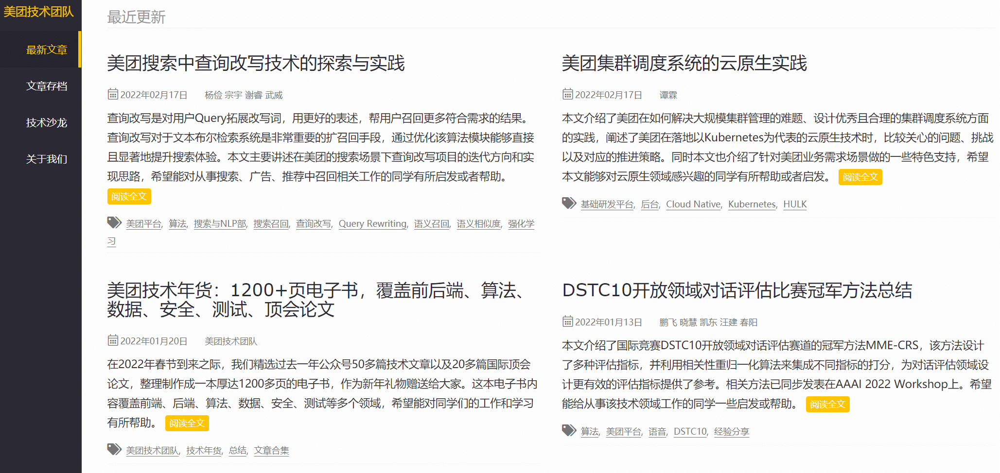
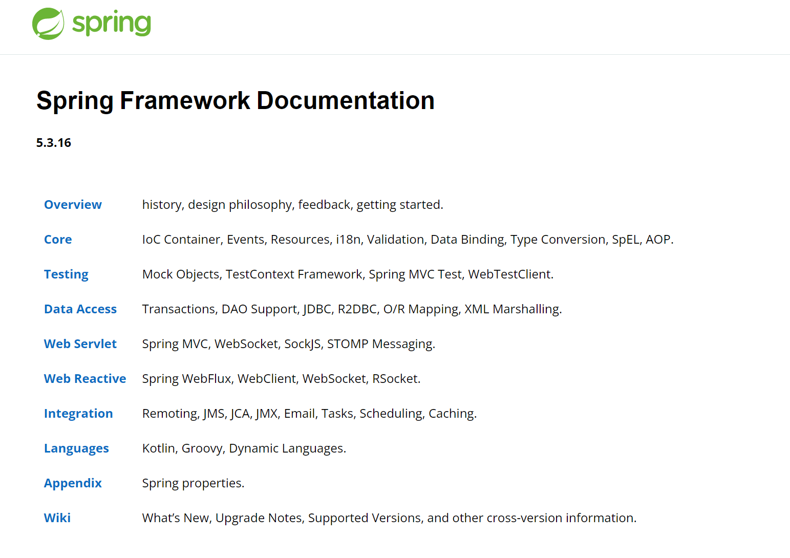

## B站

**推荐指数：**:star::star::star::star::star:

没有人不知道这个网站吧，网友：我在B站上大学。

[Bilibili](https://www.bilibili.com/)

## 知乎

**推荐指数：**:star::star::star::star:

之前知乎还没有被公众号攻陷的时候还挺好的，回答质量都挺高的。

现在已经被几大程序员up主攻陷了，到处都是公众号推送，一篇文章从微信一路粘贴到知乎。

而且这种文章的质量越来越差，但不可否认，对于初学者还是很有用的，我们应当择其善者而从之。

如果是很严肃，很严谨的问题，不要去看网红文章了，毫无营养。

逛知乎一定要注意甄别优良文章。

我已拉黑的微信公众号up主（拉黑原因懂得都懂）：

敖丙（疫情期间不知道怎么火起来的）

帅地（现在已经是专职自媒体了，贩卖焦虑，然后给厂商卖服务器）

基本上你在知乎搜什么Java面试的问题下面，都有这几个人存在。特别火的文章，请你放心，都是网红文章，没有什么用的，只会贩卖焦虑。

[知乎官网](https://www.zhihu.com/)

## GitHub

**推荐指数：**:star::star::star::star::star:

Github 永远的神。程序世界里的淘宝，搜啥有啥。会搜的和不会搜的，真不是一个档次。

缺点：可能被墙，访问速度比较慢，可以试试下面这个

[GitHub](https://github.com/)

## Gitee

**推荐指数：**:star::star::star::star::star:

Github在国内的复刻版。

优点：访问速度快，基本上Github上比较火的项目在这里都有。够用了。

[Gitee](https://gitee.com/)

## 掘金社区

**推荐指数：**:star::star::star::star::star:

小众社区，主要是因为它的SEO做的不好，所以百度等搜索引擎都搜不到它里面的文章。

文章质量本身都很好，但是随着自媒体的攻入，也有不少烂文章。

和看知乎一样，请自行斟酌比较火的文章的质量。

[掘金社区](https://juejin.cn/)

## 美团技术团队

**推荐指数：**:star::star::star::star:

美团官方的技术团队创建的博客，上面分享的文章都极其硬核。

纯纯的干货，主要是太干了，小白慎重阅读。

[美团技术团队博客](https://tech.meituan.com/)

## 牛客网

**推荐指数：**:star::star::star::star::star:

程序员的一切这里都有。

技术、刷题、社区、面经、求职、招聘。

[牛客网](https://www.nowcoder.com/)

## LeetCode

**推荐指数：**:star::star::star::star::star:

校招、社招都必备的算法刷题网站。

有很多大神在上面写题解，讨论，你一定会受益匪浅。

[LeetCode官网](https://leetcode-cn.com/)

## Hashnode

**推荐指数：**:star::star::star::star:

程序员的交流社区，主要为前端css，js。

缺点：访问稍慢，基本上都是外国网友分享的文章，所以都是英文的。

优点：质量很好，往往有惊喜。

[Hashnode官网](https://hashnode.com/)

## Spring官方文档

**推荐指数：**:star::star::star::star:

Spring框架相关的官方文章，内容详尽，关于Spring框架你想知道的，这里肯定都有。

缺点：纯英文，有难度，挺耗时间。

优点：质量很好，有HTML，PDF等多种版本可阅读。

顺便说一句，当你已经有开发经验，学习技术的最好方式就是去阅读官方文档。

[Spring官方文档地址](https://docs.spring.io/spring-framework/docs)

## Zlibrary

**推荐指数：**:star::star::star::star::star:

电子书大全，各种书籍都有。

各种格式都有。（pdf、mobi、azw3、equb)

真正的电子书神器。

每天有几次免费下载机会，登录后可以增加几次。

不要一天下载好多，没啥用，明天再下就是了。

我也会在我的网站的资源板块分享一些电子书，放在网盘里，敬请关注。

缺点：这个电子书网站的网址经常变动，因为访问的人太多了，如果网址不好使了，记得公众号联系我补链接。

[Zlibrary官网](https://zh.usa1lib.org/)

## 思否（segmentfault）

**推荐指数：**:star::star::star::star:

国内技术交流社区，质量比CSDN好。

主要就是初级程序员解决一些小细节问题，很好用。

[思否（segmentfault）](https://segmentfault.com/)

## 不断更新中~~~

会持续更新的，记得多回来看看。

## 感谢

感谢每一位小伙伴的支持，感谢每一颗❤️。觉得有帮助，请点赞转发关注支持一下！

有任何疑问都可以留言公众号（idea小时），看到消息我会第一时间回复。对于问的多的问题，我会出文章解答的！

