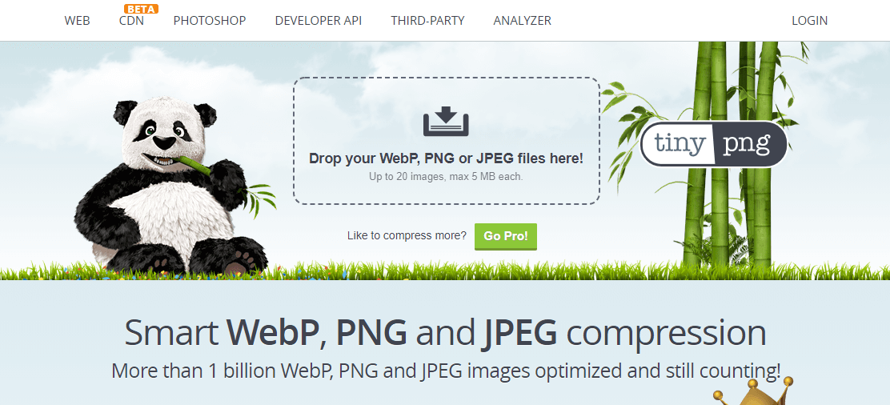

# :man_student: 学术研究类工具推荐

## Process On

**推荐指数：:star:**:star::star::star::star:

免费的，原型图、UML、BPMN、网络拓扑图等多种图形绘制。

[Process On官网](https://www.processon.com/)

## Zlibrary

**推荐指数：**:star::star::star::star::star:

电子书大全，各种书籍都有，学术必备。

各种格式都有。（pdf、mobi、azw3、equb)

真正的电子书神器。

每天有几次免费下载机会，登录后可以增加几次。

不要一天下载好多，没啥用，明天再下就是了。

我也会在我的网站的资源板块分享一些电子书，放在网盘里，敬请关注。

缺点：这个电子书网站的网址经常变动，因为访问的人太多了，如果网址不好使了，记得公众号联系我补链接。

[Zlibrary官网](https://zh.usa1lib.org/)

## tinypng

**推荐指数：:star:**:star::star::star::star:

图片压缩，可批量。

[tinypng官网](https://tinypng.com/)

## 不断更新中~~~

会持续更新的，记得多回来看看。

## 感谢

感谢每一位小伙伴的支持，感谢每一颗❤️。觉得有帮助，请点赞转发关注支持一下！

有任何疑问都可以留言公众号（idea小时），看到消息我会第一时间回复。对于问的多的问题，我会出文章解答的！

