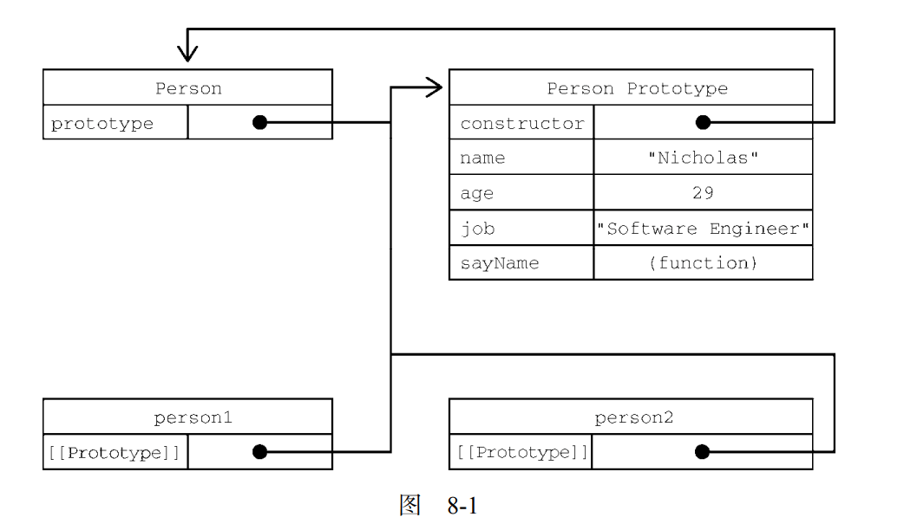

## 定义

对象：一组属性的无序集合（可以当成散列表，值可以是数据或函数）

## 创建方式

### Object方式

```js
let person = new Object(); 
person.name = "Nicholas"; 
person.age = 29; 
person.job = "Software Engineer"; 
person.sayName = function() { 
 console.log(this.name); 
}; 
```

### 对象字面量

```js
let person = { 
 name: "Nicholas", 
 age: 29, 
 job: "Software Engineer", 
 sayName() { 
 console.log(this.name); 
 } 
}; 
```

### 工厂模式

```js
function createPerson(name, age, job) { 
 let o = new Object(); 
 o.name = name; 
 o.age = age; 
 o.job = job; 
 o.sayName = function() { 
 console.log(this.name); 
 }; 
 return o; 
} 
let person1 = createPerson("Nicholas", 29, "Software Engineer"); 
let person2 = createPerson("Greg", 27, "Doctor"); 
```

工厂模式没有解决**对象标识**的问题：工厂模式虽然解决了创建多个类似对象的问题，但是我们不能够知道对象的类型。

### 构造函数

```js
function Person(name, age, job){ 
 this.name = name; 
 this.age = age; 
 this.job = job; 
 this.sayName = function() { 
 console.log(this.name); 
 }; 
} 
let person1 = new Person("Nicholas", 29, "Software Engineer"); 
let person2 = new Person("Greg", 27, "Doctor"); 
person1.sayName(); // Nicholas 
person2.sayName(); // Greg
```

> 构造函数的函数名的首字母要大写，只是用于区分普通函数和构造函数。

这里我们定义的构造函数全都是自定义构造函数，JS本身也有内置的构造函数，比方说Object和Array这样的原生构造函数。

构造函数和上面工厂模式的代码几乎没有什么区别，只是：

1. 没有显式地创建对象
2. 属性和方法赋值给了this
3. 没有return

构造函数要使用new操作符来创建对象，此时会执行下面的操作：

1. 在内存中创建一个新的对象
2. 这个新对象内部的[[Prototype]]特性被赋值为构造函数的prototype属性。
3. 构造函数内部的this被赋值为这个新对象（this指向新对象）
4. 执行构造函数内部的代码
5. 如果构造函数返回非空对象，则返回该对象；否则，返回创建的这个新对象。

**注意**：

1. 每个构造函数创建出来的对象，都有个constructor属性指向它的构造器

   ```js
   console.log(person1.constructor == Person); // true 
   console.log(person2.constructor == Person); // true 
   ```

2. 每个对象都是 Object 的实例，同时也是 Person 的实例

   ```js
   console.log(person1 instanceof Object); // true 
   console.log(person1 instanceof Person); // true 
   console.log(person2 instanceof Object); // true 
   console.log(person2 instanceof Person); // true
   ```

3. 赋值给变量的函数表达式也可以表示构造函数

   ```js
   let Person = function(name, age, job) { 
    this.name = name; 
    this.age = age; 
    this.job = job; 
    this.sayName = function() { 
    console.log(this.name); 
    }; 
   } 
   let person1 = new Person("Nicholas", 29, "Software Engineer"); 
   let person2 = new Person("Greg", 27, "Doctor"); 
   ```

4. new操作时，不传参可以不写括号

   ```js
   let person2 = new Person; 
   ```

#### 与普通函数的区别

构造函数也是个普通的函数，只不过可以用new操作符调用，当然也可以直接调用。直接调用可能会把属性直接绑定在全局window对象上。

#### 问题

构造函数中定义的方法会在每个实例上都创建一遍。

```js
console.log(person1.sayName == person2.sayName); //false 
```

可以通过在构造函数外定义好方法，再在构造函数内赋值，就会使用同一份方法。

```js
function Person(name, age, job){ 
 this.name = name; 
 this.age = age; 
 this.job = job; 
 this.sayName = sayName; 
} 
function sayName() { 
 console.log(this.name); 
} 
let person1 = new Person("Nicholas", 29, "Software Engineer"); 
let person2 = new Person("Greg", 27, "Doctor"); 
person1.sayName(); // Nicholas 
person2.sayName(); // Greg 
```

但是这样的代码不好维护，不聚集。通过原型模式可以解决该问题。

### 原型模式

每个函数都会创建一个prototype属性，这个属性是个对象，称之为原型对象。使用原型对象的好处是：在它上面定义的属性和方法可以被对象实例共享。原来在构造函数里的赋值，可以直接赋值给它们的原型。

```js
function Person() {} 
Person.prototype.name = "Nicholas"; 
Person.prototype.age = 29; 
Person.prototype.job = "Software Engineer"; 
Person.prototype.sayName = function() { 
 console.log(this.name); 
}; 
let person1 = new Person(); 
person1.sayName(); // "Nicholas" 
let person2 = new Person(); 
person2.sayName(); // "Nicholas" 
console.log(person1.sayName == person2.sayName); // true 
```

只要创建一个函数，就会给这个函数生成一个prototype属性，指向它的原型对象。而它的原型对象会获得一个constructor属性，指向与之关联的构造函数。二者循环引用。

每次调用构造函数创建一个新实例，这个实例的内部[[Prototype]]指针就会被赋值为构造函数的原型对象。脚本中没有访问这个[[Prototype]]特性的标准方式，但 Firefox、Safari 和 Chrome 会在每个对象上暴露\__proto\__属性，通过这个属性可以访问对象的原型。

> 关键在于理解：实例和构造函数没有直接联系，而是实例与构造函数的原型对象有直接联系。

```js
/** 
 * 正常的原型链都会终止于 Object 的原型对象
 * Object 原型的原型是 null 
 */ 
console.log(Person.prototype.__proto__ === Object.prototype); // true 
console.log(Person.prototype.__proto__.constructor === Object); // true 
console.log(Person.prototype.__proto__.__proto__ === null); // true 
console.log(Person.prototype.__proto__); 
// { 
// constructor: f Object(), 
// toString: ... 
// hasOwnProperty: ... 
// isPrototypeOf: ... 
// ... 
// } 
```



isPrototypeOf()会在传入参数的[[Prototype]]指向调用它的对象时，返回 true

```js
console.log(Person.prototype.isPrototypeOf(person1)); // true 
console.log(Person.prototype.isPrototypeOf(person2)); // true 
```

Object 类型有一个方法叫 Object.getPrototypeOf()，返回参数的内部特性 [[Prototype]]的值

```js
console.log(Object.getPrototypeOf(person1) == Person.prototype); // true 
console.log(Object.getPrototypeOf(person1).name); // "Nicholas"
```

Object 类型还有一个 setPrototypeOf()方法，可以向实例的私有特性[[Prototype]]写入一 个新值。这样就可以重写一个对象的原型继承关系：

```js
let biped = { 
 numLegs: 2 
}; 
let person = { 
 name: 'Matt' 
}; 
Object.setPrototypeOf(person, biped); 
console.log(person.name); // Matt 
console.log(person.numLegs); // 2 
console.log(Object.getPrototypeOf(person) === biped); // true 
```

> Object.setPrototypeOf()可能会严重影响代码性能。

为避免使用 Object.setPrototypeOf()可能造成的性能下降，可以通过 Object.create()来创 建一个新对象，同时为其指定原型：

```js
let biped = { 
 numLegs: 2 
}; 
let person = Object.create(biped); 
person.name = 'Matt'; 
console.log(person.name); // Matt 
console.log(person.numLegs); // 2 
console.log(Object.getPrototypeOf(person) === biped); // true
```

#### 对象属性查找机制

在通过对象访问属性时，会按照这个属性的名称开始搜索。**搜索开始于对象实例本身**。如果在这个 实例上发现了给定的名称，则返回该名称对应的值。如果没有找到这个属性，**则搜索会沿着指针进入原型对象**，然后在原型对象上找到属性后，再返回对应的值。虽然可以通过实例读取原型对象上的值，**但不可能通过实例重写这些值**。

#### 遮蔽（shadow）原型对象上的同名属性

只要给对象实例添加一个属性，这个属性就会**遮蔽（shadow）原型对象上的同名属性**，也就是虽然不会修改它，但会屏蔽对它的访问。即使在实例上把这个属性设置为 null，也不会恢复它和原型的联系。不过，**使用 delete 操作符可以完全删除实例上的这个属性**，从而让标识符解析过程能够继续搜索原型对象。

**hasOwnProperty()**方法用于确定某个属性是在实例上还是在原型对象上。这个方法是继承自 Object 的，会在属性存在于调用它的对象实例上时返回 true

> ECMAScript 的 Object.getOwnPropertyDescriptor()方法只对实例属性有 效。要取得原型属性的描述符，就必须直接在原型对象上调用 Object.getOwnPropertyDescriptor()。

#### 原型与in操作符

有两种方式使用 in 操作符：单独使用和在 for-in 循环中使用。在单独使用时，in 操作符会在**可以通过对象访问指定属性时返回 true**，无论该属性是在实例上还是在原型上。

而 hasOwnProperty()只有属性**存在于实例上**时才返回 true。因此，只要 in 操作符返回 true 且 hasOwnProperty()返回 false，就说明该属性是一个**原型属性**。

```js
function Person() {} 
Person.prototype.name = "Nicholas"; 
Person.prototype.age = 29; 
Person.prototype.job = "Software Engineer"; 
Person.prototype.sayName = function() { 
 console.log(this.name); 
}; 
let person = new Person(); 
console.log(hasPrototypeProperty(person, "name")); // true 
person.name = "Greg"; 
console.log(hasPrototypeProperty(person, "name")); // false
```


在这里，name 属性首先只存在于原型上，所以 hasPrototypeProperty()返回 true。而在实例 上重写这个属性后，实例上也有了这个属性，因此 hasPrototypeProperty()返回 false。即便此时 原型对象还有 name 属性，但因为实例上的属性遮蔽了它，所以不会用到。

要获得对象上所有可枚举的实例属性，可以使用 **Object.keys()**方法。这个方法接收一个对象作 为参数，返回包含该对象所有可枚举属性名称的字符串数组

如果想列出所有实例属性，无论是否可以枚举，都可以使用 **Object.getOwnPropertyNames()**

**Object.keys()**和 **Object.  getOwnPropertyNames()**在适当的时候都可用来代替 for-in 循环

在 ECMAScript 6 新增符号类型之后，相应地出现了增加一个 Object.getOwnPropertyNames() 的兄弟方法的需求，因为以符号为键的属性没有名称的概念。因此，**Object.getOwnPropertySymbols()**方法就出现了，这个方法与 Object.getOwnPropertyNames()类似，只是针对符号而已。

#### 属性枚举顺序

for-in 循环、Object.keys()、Object.getOwnPropertyNames()、Object.getOwnPropertySymbols()以及 Object.assign()在属性枚举顺序方面有很大区别。for-in 循环和 Object.keys() 的枚举顺序是不确定的，取决于 JavaScript 引擎，可能因浏览器而异。 Object.getOwnPropertyNames()、Object.getOwnPropertySymbols()和 Object.assign() 的枚举顺序是确定性的。先以升序枚举数值键，然后以插入顺序枚举字符串和符号键。在对象字面量中定义的键以它们逗号分隔的顺序插入。

#### 原型的动态性

**从原型上搜索值的过程是动态的**，所以即使实例在修改原型之前已经存在，任何时候对原型对象所做的修改也会在实例上反映出来。

主要原因是实例与原型之间**松散的联系**，**实例与原型之间的链接就是简单的指针**，而不是保存的副本。

重写构造函数上的原型之后再创建的实例才会引用新的原型。而**在此之前创建的实例仍然会引用最初的原型**。

#### 原型的问题

**最大的问题源自它的共享特性**，所有实例默认都取得相同的属性值。而一般来说，不同的实例应该有属于自己的不同的属性副本，这就是实际开发中，通常不单独使用原型模式的原因。

### 属性类型

属性分两种：数据属性和访问器属性。

#### 数据属性

数据属性包含一个保存数据值的位置。值会从这个位置读取，也会写入到这个位置。数据属性有 4 个特性描述它们的行为。

1.  **[[Configurable]]**：表示属性是否可以通过 delete 删除并重新定义，是否可以修改它的特 性，以及是否可以把它改为访问器属性。默认情况下，所有直接定义在对象上的属性的这个特 性都是 true，如前面的例子所示。
2.  **[[Enumerable]]**：表示属性是否可以通过 for-in 循环返回。默认情况下，所有直接定义在对象上的属性的这个特性都是 true，如前面的例子所示。
3. **[[Writable]]**：表示属性的值是否可以被修改。默认情况下，所有直接定义在对象上的属性的 这个特性都是 true，如前面的例子所示。
4. **[[Value]]**：包含属性实际的值。这就是前面提到的那个读取和写入属性值的位置。这个特性 的默认值为 undefined。 在像前面例子中那样将属性显式添加到对象之后，[[Configurable]]、[[Enumerable]]和 [[Writable]]都会被设置为 true，而[[Value]]特性会被设置为指定的值。


要修改属性的默认特性，就必须使用 Object.defineProperty()方法。这个方法接收 3 个参数： 要给其添加属性的对象、属性的名称和一个描述符对象。最后一个参数，即描述符对象上的属性可以包 含：configurable、enumerable、writable 和 value，跟相关特性的名称一一对应。根据要修改的特性，可以设置其中一个或多个值。比如：

```js
let person = {}; 
Object.defineProperty(person, "name", { 
 writable: false, 
 value: "Nicholas" 
}); 
console.log(person.name); // "Nicholas" 
person.name = "Greg"; 
console.log(person.name); // "Nicholas"
```

在**非严格模式**下尝试给只读属性重新赋值会被忽略。在**严格模式**下，尝试修改只读属性的值会抛出错误。

因此，虽然可以对同一个属性多次调用 Object.defineProperty()，但在把 configurable 设 置为 false 之后就会受限制了。 在调用 Object.defineProperty()时，configurable、enumerable 和 writable 的值如果不 指定，则都默认为 false。多数情况下，可能都不需要 Object.defineProperty()提供的这些强大 的设置，但要理解 JavaScript 对象，就要理解这些概念。

#### 访问器属性

访问器属性不包含数据值。相反，它们包含一个获取（getter）函数和一个设置（setter）函数，不过这两个函数不是必需的。

**在读取访问器属性时**，会调用获取函数，这个函数的责任就是返回一个有效 的值。

**在写入访问器属性时**，会调用设置函数并传入新值，这个函数必须决定对数据做出什么修改。

访问器属性有 4 个特性描述它们的行为。

1.  **[[Configurable]]**：表示属性是否可以通过 delete 删除并重新定义，是否可以修改它的特性，以及是否可以把它改为数据属性。默认情况下，所有直接定义在对象上的属性的这个特性 都是 true。
2. **[[Enumerable]]**：表示属性是否可以通过 for-in 循环返回。默认情况下，所有直接定义在对 象上的属性的这个特性都是 true。
3. **[[Get]]**：获取函数，在读取属性时调用。默认值为 undefined。
4. **[[Set]]**：设置函数，在写入属性时调用。默认值为 undefined。 

访问器属性是不能直接定义的，必须使用 Object.defineProperty()。


#### 属性其他细节

ECMAScript 提供了 Object.defineProperties()方法。这个方法可以通过多个描述符一次性定义多个属性。它接收两个参数：要为之添 加或修改属性的对象和另一个描述符对象，其属性与要添加或修改的属性一一对应。

使用 Object.getOwnPropertyDescriptor()方法可以取得指定属性的属性描述符。这个方法接 收两个参数：属性所在的对象和要取得其描述符的属性名。返回值是一个对象，对于访问器属性包含 configurable、enumerable、get 和 set 属性，对于数据属性包含 configurable、enumerable、 writable 和 value 属性。

ECMAScript 2017 新增了 Object.getOwnPropertyDescriptors()静态方法。这个方法实际上 会在每个自有属性上调用 Object.getOwnPropertyDescriptor()并在一个新对象中返回它们。


### 属性迭代

ECMAScript 2017 新增了两 个静态方法，用于将对象内容转换为序列化的——更重要的是可迭代的——格式。

这两个静态方法 **Object.values()**和 **Object.entries()**接收一个对象，返回它们内容的数组。Object.values() 返回对象值的数组，Object.entries()返回键/值对的数组

```js
const o = { 
 foo: 'bar', 
 baz: 1, 
 qux: {} 
}; 
console.log(Object.values(o)); 
// ["bar", 1, {}] 
console.log(Object.entries((o))); 
// [["foo", "bar"], ["baz", 1], ["qux", {}]] 
```

注意，非字符串属性会被转换为字符串输出。另外，这两个方法执行对象的浅复制，符号属性会被忽略：

```js
const o = { 
 qux: {} 
}; 
console.log(Object.values(o)[0] === o.qux); 
// true 
console.log(Object.entries(o)[0][1] === o.qux); 
// true 

const sym = Symbol(); 
const o = { 
 [sym]: 'foo' 
}; 
console.log(Object.values(o)); 
// [] 
console.log(Object.entries((o))); 
// [] 
```

## 增强语法

### 属性值简写

```js
let name = 'Matt'; 
let person = { 
 name 
}; 
console.log(person); // { name: 'Matt' } 
```


### 可计算属性

有了可计算属性，就可以在对象字面量中完成动态属性赋值。中括号包围的对象属性键告诉运行时 将其作为 JavaScript 表达式而不是字符串来求值：

```js
const nameKey = 'name'; 
const ageKey = 'age'; 
const jobKey = 'job'; 
let person = { 
 [nameKey]: 'Matt', 
 [ageKey]: 27, 
 [jobKey]: 'Software engineer' 
}; 
console.log(person); // { name: 'Matt', age: 27, job: 'Software engineer' } 
```

> 可计算属性表达式中抛出任何错误都会中断对象创建。如果计算属性的表达式有副 作用，那就要小心了，因为如果表达式抛出错误，那么之前完成的计算是不能回滚的。


### 简写方法名

```js
let person = { 
 sayName: function(name) { 
 console.log(`My name is ${name}`); 
 } 
}; 
person.sayName('Matt'); // My name is Matt

let person = { 
 sayName(name) { 
 console.log(`My name is ${name}`); 
 } 
}; 
person.sayName('Matt'); // My name is Matt 

let person = { 
 name_: '', 
 get name() { 
 return this.name_; 
 }, 
 set name(name) { 
 this.name_ = name; 
 }, 
 sayName() { 
 console.log(`My name is ${this.name_}`); 
 } 
}; 
person.name = 'Matt'; 
person.sayName(); // My name is Matt 

const methodKey = 'sayName'; 
let person = { 
 [methodKey](name) { 
 console.log(`My name is ${name}`); 
 } 
} 
person.sayName('Matt'); // My name is Matt 
```


## 对象标识及相等判定

```js
// 这些是===符合预期的情况
console.log(true === 1); // false 
console.log({} === {}); // false 
console.log("2" === 2); // false 
// 这些情况在不同 JavaScript 引擎中表现不同，但仍被认为相等
console.log(+0 === -0); // true 
console.log(+0 === 0); // true 
console.log(-0 === 0); // true 
// 要确定 NaN 的相等性，必须使用极为讨厌的 isNaN() 
console.log(NaN === NaN); // false 
console.log(isNaN(NaN)); // true 
```

为改善这类情况，ECMAScript 6 规范新增了 Object.is()，这个方法与===很像，但同时也考虑 到了上述边界情形。这个方法必须接收两个参数：

```js
console.log(Object.is(true, 1)); // false 
console.log(Object.is({}, {})); // false 
console.log(Object.is("2", 2)); // false 
// 正确的 0、-0、+0 相等/不等判定
console.log(Object.is(+0, -0)); // false 
console.log(Object.is(+0, 0)); // true 
console.log(Object.is(-0, 0)); // false 
// 正确的 NaN 相等判定
console.log(Object.is(NaN, NaN)); // true 
//要检查超过两个值，递归地利用相等性传递即可：
function recursivelyCheckEqual(x, ...rest) { 
 return Object.is(x, rest[0]) && 
 (rest.length < 2 || recursivelyCheckEqual(...rest)); 
}
```


## 混入/合并

### 定义

**就是把源对象所有的 本地属性一起复制到目标对象上，因为目标对象通过混入源对象的属性得到了增强。**

ECMAScript 6 专门为合并对象提供了 Object.assign()方法。这个方法接收一个目标对象和一个 或多个源对象作为参数，然后将每个源对象中可枚举（Object.propertyIsEnumerable()返回 true） 和自有（Object.hasOwnProperty()返回 true）属性复制到目标对象。以字符串和符号为键的属性 会被复制。对每个符合条件的属性，这个方法会使用源对象上的[[Get]]取得属性的值，然后使用目标对象上的[[Set]]设置属性的值。

Object.assign()实际上对每个源对象执行的是浅复制。如果多个源对象都有相同的属性，则使 用最后一个复制的值。此外，从源对象访问器属性取得的值，比如获取函数，会作为一个静态值赋给目 标对象。换句话说，不能在两个对象间转移获取函数和设置函数。

如果赋值期间出错，则操作会中止并退出，同时抛出错误。Object.assign()没有“回滚”之前 赋值的概念，因此它是一个尽力而为、可能只会完成部分复制的方法。

## 对象解构

ECMAScript 6 新增了**对象解构语法**，可以在一条语句中使用嵌套数据实现一个或多个赋值操作。简 单地说，对象解构就是使用与对象匹配的结构来实现对象属性赋值。

```js
let person = { 
 name: 'Matt', 
 age: 27 
}; 
let { name: personName, age: personAge } = person; 
console.log(personName); // Matt 
console.log(personAge); // 27 
```

解构赋值不一定与对象的属性匹配。赋值的时候可以忽略某些属性，而如果引用的属性不存在，则该变量的值就是 undefined

解构在内部使用函数 ToObject()（不能在运行时环境中直接访问）把源数据结构转换为对象。这 意味着在对象解构的上下文中，原始值会被当成对象。这也意味着（根据 ToObject()的定义），null 和 undefined 不能被解构，否则会抛出错误。


### 嵌套解构

解构赋值可以使用嵌套结构，以匹配嵌套的属性

在外层属性没有定义的情况下不能使用嵌套解构。无论源对象还是目标对象都一样

### 部分解构

需要注意的是，涉及多个属性的解构赋值是一个输出无关的顺序化操作。如果一个解构表达式涉及 多个赋值，开始的赋值成功而后面的赋值出错，则整个解构赋值只会完成一部分

### 参数上下文匹配

在函数参数列表中也可以进行解构赋值。对参数的解构赋值不会影响 arguments 对象，但可以在函数签名中声明在函数体内使用局部变量

```js
let person = { 
 name: 'Matt', 
 age: 27 
}; 
function printPerson(foo, {name, age}, bar) { 
 console.log(arguments); 
 console.log(name, age); 
} 
function printPerson2(foo, {name: personName, age: personAge}, bar) { 
 console.log(arguments); 
 console.log(personName, personAge); 
} 
printPerson('1st', person, '2nd'); 
// ['1st', { name: 'Matt', age: 27 }, '2nd'] 
// 'Matt', 27 
printPerson2('1st', person, '2nd'); 
// ['1st', { name: 'Matt', age: 27 }, '2nd'] 
// 'Matt', 27
```


## 继承

ECMAScript 6 开始正式支持类和继承。ES6 的类旨在完全涵盖之前规范设计的基于原型的继承模 式。不过，无论从哪方面看，ES6 的类都仅仅是封装了 ES5.1 构造函数加原型继承的语法糖而已。

### 原型链

ECMA-262 把原型链定义为 ECMAScript 的主要继承方式。其基本思想就是通过原型继承多个引用类型的属性和方法。

原型链扩展了前面描述的原型搜索机制。在通过原型链实现继承之后，搜索就可以继承向上，搜索原型的原型。

默认情况下，所有引用类型都继承自 Object，这也是通过原型链实 现的。任何函数的默认原型都是一个 Object 的实例，这意味着这个实例有一个内部指针指向 Object.prototype。这也是为什么自定义类型能够继承包括 toString()、valueOf()在内的所有默 认方法的原因。

子类有时候需要覆盖父类的方法，或者增加父类没有的方法。为此，这些方法必须在原型赋值之后 再添加到原型上。

```js
function SuperType() { 
 this.property = true; 
} 
SuperType.prototype.getSuperValue = function() { 
 return this.property; 
}; 
function SubType() { 
 this.subproperty = false; 
} 
// 继承 SuperType 
SubType.prototype = new SuperType(); 
// 新方法
SubType.prototype.getSubValue = function () { 
 return this.subproperty; 
}; 
// 覆盖已有的方法
SubType.prototype.getSuperValue = function () { 
 return false; 
}; 
let instance = new SubType(); 
console.log(instance.getSuperValue()); // false 
```

#### 原型链的问题

主要问题出现在原型中包含引用值的时候。前 面在谈到原型的问题时也提到过，原型中包含的引用值会在所有实例间共享，这也是为什么属性通常会 在构造函数中定义而不会定义在原型上的原因。在使用原型实现继承时，原型实际上变成了另一个类型 的实例。这意味着原先的实例属性摇身一变成为了原型属性。

原型链的第二个问题是，子类型在实例化时不能给父类型的构造函数传参。事实上，我们无法在不 影响所有对象实例的情况下把参数传进父类的构造函数。再加上之前提到的原型中包含引用值的问题， 就导致原型链基本不会被单独使用。

### 盗用构造函数

为了解决原型包含引用值导致的继承问题，一种叫作“盗用构造函数”（constructor stealing）的技 术在开发社区流行起来（这种技术有时也称作“对象伪装”或“经典继承”）。基本思路很简单：在子类 构造函数中调用父类构造函数。因为毕竟函数就是在特定上下文中执行代码的简单对象，所以可以使用 apply()和 call()方法以新创建的对象为上下文执行构造函数。

#### 盗用构造函数的缺点

盗用构造函数的主要缺点，也是使用构造函数模式自定义类型的问题：必须在构造函数中定义方法，

### 组合继承

组合继承（有时候也叫伪经典继承）综合了原型链和盗用构造函数，将两者的优点集中了起来。基 本的思路是使用原型链继承原型上的属性和方法，而通过盗用构造函数继承实例属性。这样既可以把方 法定义在原型上以实现重用，又可以让每个实例都有自己的属性。

### 原型式继承

```js
function object(o) { 
 function F() {} 
 F.prototype = o; 
 return new F(); 
}
```

这个 object()函数会创建一个临时构造函数，将传入的对象赋值给这个构造函数的原型，然后返 回这个临时类型的一个实例。本质上，object()是对传入的对象执行了一次浅复制。

```js
let person = { 
 name: "Nicholas", 
 friends: ["Shelby", "Court", "Van"] 
}; 
let anotherPerson = object(person); 
anotherPerson.name = "Greg"; 
anotherPerson.friends.push("Rob"); 
let yetAnotherPerson = object(person); 
yetAnotherPerson.name = "Linda"; 
yetAnotherPerson.friends.push("Barbie"); 
console.log(person.friends); // "Shelby,Court,Van,Rob,Barbie"
```

ECMAScript 5 通过增加 Object.create()方法将原型式继承的概念规范化了。这个方法接收两个 参数：作为新对象原型的对象，以及给新对象定义额外属性的对象（第二个可选）。在只有一个参数时， Object.create()与这里的 object()方法效果相同：

```js
let person = { 
 name: "Nicholas", 
 friends: ["Shelby", "Court", "Van"] 
}; 
let anotherPerson = Object.create(person); 
anotherPerson.name = "Greg"; 
anotherPerson.friends.push("Rob"); 
let yetAnotherPerson = Object.create(person); 
yetAnotherPerson.name = "Linda"; 
yetAnotherPerson.friends.push("Barbie"); 
console.log(person.friends); // "Shelby,Court,Van,Rob,Barbie" 

```

原型式继承非常适合不需要单独创建构造函数，但仍然需要在对象间共享信息的场合。但要记住， 属性中包含的引用值始终会在相关对象间共享，跟使用原型模式是一样的。

### 寄生式继承

与原型式继承比较接近的一种继承方式是寄生式继承（parasitic inheritance），也是 Crockford 首倡的 一种模式。寄生式继承背后的思路类似于寄生构造函数和工厂模式：创建一个实现继承的函数，以某种 方式增强对象，然后返回这个对象。基本的寄生继承模式如下：

```js
function createAnother(original){ 
 let clone = object(original); // 通过调用函数创建一个新对象
 clone.sayHi = function() { // 以某种方式增强这个对象
 console.log("hi"); 
 }; 
 return clone; // 返回这个对象
}

let person = { 
 name: "Nicholas", 
 friends: ["Shelby", "Court", "Van"] 
}; 
let anotherPerson = createAnother(person); 
anotherPerson.sayHi(); // "hi" 
```

寄生式继承同样适合主要关注对象，而不在乎类型和构造函数的场景。object()函数不是寄生式 继承所必需的，任何返回新对象的函数都可以在这里使用。

> 通过寄生式继承给对象添加函数会导致函数难以重用，与构造函数模式类似。

### 寄生式组合继承

组合继承其实也存在效率问题。最主要的效率问题就是父类构造函数始终会被调用两次：一次在是 创建子类原型时调用，另一次是在子类构造函数中调用。本质上，子类原型最终是要包含超类对象的所 有实例属性，子类构造函数只要在执行时重写自己的原型就行了

寄生式组合继承通过盗用构造函数继承属性，但使用混合式原型链继承方法。基本思路是不通过调 用父类构造函数给子类原型赋值，而是取得父类原型的一个副本。说到底就是使用寄生式继承来继承父 类原型，然后将返回的新对象赋值给子类原型。寄生式组合继承的基本模式如下所示：

```js
function inheritPrototype(subType, superType) { 
 let prototype = object(superType.prototype); // 创建对象
 prototype.constructor = subType; // 增强对象 
 subType.prototype = prototype; // 赋值对象
} 

function SuperType(name) { 
 this.name = name; 
 this.colors = ["red", "blue", "green"]; 
} 
SuperType.prototype.sayName = function() { 
 console.log(this.name); 
}; 
function SubType(name, age) { 
 SuperType.call(this, name);
     this.age = age; 
} 
inheritPrototype(SubType, SuperType); 
SubType.prototype.sayAge = function() { 
 console.log(this.age); 
}; 

```

这里只调用了一次 SuperType 构造函数，避免了 SubType.prototype 上不必要也用不到的属性， 因此可以说这个例子的效率更高。而且，原型链仍然保持不变，因此 instanceof 操作符和 isPrototypeOf()方法正常有效。寄生式组合继承可以算是引用类型继承的最佳模式。
