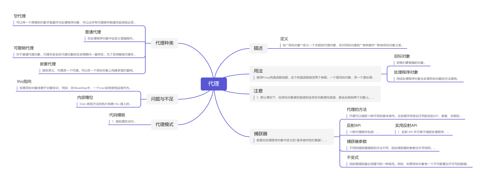

## 描述

### 定义

给**目标对象**定义一个关联的代理对象，在对目标对象的**各种操作**影响目标对象之前，可以在代理对象中对这些操作**加以控制**。

> 代理和反射是ES6新增的特性，是一项新的基础特性，并不支持向后兼容，很多转译程序都不能将代理行为转换成之前的ECMAScript代码，现在浏览器的支持还不是很好。

## 用法

使用Proxy构造函数创建，这个构造函数接受两个参数，一个是目标对象，另一个是处理程序对象。

### 目标对象

即我们要增强的对象。

### 处理程序对象

用该处理程序对象去处理目标对象的方法调用。

## 注意

1. 默认情况下，给目标对象属性赋值和给目标对象属性赋值，都会反映到两个对象上。
2. Proxy.prototype是undefined，因此不能使用instance of操作符。
3. 可以使用 === 来区分代理对象和目标对象

```js
const target = { 
 id: 'target' 
}; 
const handler = {}; 
const proxy = new Proxy(target, handler); 
// id 属性会访问同一个值
console.log(target.id); // target 
console.log(proxy.id); // target 
// 给目标属性赋值会反映在两个对象上
// 因为两个对象访问的是同一个值
target.id = 'foo'; 
console.log(target.id); // foo 
console.log(proxy.id); // foo 
// 给代理属性赋值会反映在两个对象上
// 因为这个赋值会转移到目标对象
proxy.id = 'bar'; 
console.log(target.id); // bar 
console.log(proxy.id); // bar 
// hasOwnProperty()方法在两个地方
// 都会应用到目标对象
console.log(target.hasOwnProperty('id')); // true 
console.log(proxy.hasOwnProperty('id')); // true 
// Proxy.prototype 是 undefined 
// 因此不能使用 instanceof 操作符
console.log(target instanceof Proxy); // TypeError: Function has non-object prototype 
'undefined' in instanceof check 
console.log(proxy instanceof Proxy); // TypeError: Function has non-object prototype 
'undefined' in instanceof check 
// 严格相等可以用来区分代理和目标
console.log(target === proxy); // false
```


## 捕获器

就是在处理程序对象中定义的“基本操作的拦截器”。

一个处理程序对象中可以有若干个捕获器，每个捕获器对应一个代理的基本操作。捕获器可以在代理对象上直接或间接的调用。

### 代理的方法

代理可以捕获13种不同的基本操作。这些操作有各自不同的反射API、参数、关联的ECMAScript 操作和不变式。

### 反射API

13种代理操作包括：

1. get( )
2. set( )
3. has( )
4. defineProperty( )
5. deleteProperty( )
6. getOwnPropertyDescriptor( )
7. ownKeys( )
8. getPrototypeOf( )
9. setPrototypeOf( )
10. isExtensible( )
11. preventExtensions( )
12. apply( )
13. construct( )

##### 实用反射API

1. 反射 API 并不限于捕获处理程序；

2. 大多数反射 API 方法在 Object 类型上有对应的方法。

> 通常，Object上的方法适用于通用程序，而反射方法适用于细粒度的对象控制与操作。

3. 状态标记（以下反射API会返回成功与否的布尔值）

   ```js
   Reflect.defineProperty()
   
   Reflect.preventExtensions()  
   
   Reflect.setPrototypeOf() 
   
   Reflect.set()
   
   Reflect.deleteProperty()
   ```


### 捕获器参数

不同的捕获器捕获的方法不同，因此捕获器的参数也不尽相同。

几乎每个捕获器方法，都有以下参数：目标对象上下文、捕获函数签名。


### 不变式

说的是捕获器必须遵守的一种规范。例如：如果目标对象有一个不可配置且不可写的数据属性，那么在捕获器种如果表现出可配置或者可写的行为时，就不符合规范，此时会抛出TypeError。

```js
const target = {}; 
Object.defineProperty(target, 'foo', { 
 configurable: false, 
 writable: false, 
 value: 'bar' 
}); 
const handler = { 
 get() { 
 return 'qux'; 
 } 
}; 
const proxy = new Proxy(target, handler); 
console.log(proxy.foo); 
// TypeError 
```


## 代理种类

### 空代理

可以传一个简单的对象字面量作为处理程序对象，可以让所有代理操作畅通无阻地抵达目标对象。

### 普通代理

在处理程序对象中自定义增强操作。

### 可撤销代理

对于普通代理对象，代理关系会在代理对象的生命周期内一直存在。为了支持撤销代理关系，可以使用

```js
const target = { 
 foo: 'bar' 
}; 
const handler = { 
 get() { 
 return 'intercepted'; 
 } 
}; 
const { proxy, revoke } = Proxy.revocable(target, handler); 
console.log(proxy.foo); // intercepted 
console.log(target.foo); // bar 
revoke(); 
console.log(proxy.foo); // TypeError 
```

来创建一个可撤销代理的代理对象。

然后，在需要时，使用撤销函数revoke()来撤销代理。

撤销函数是幂等的，无论调用多少次都一样。

撤销行为是一次性的，不可逆的，在撤销后再次调用代理对象会抛出TypeError。

### 嵌套代理

顾名思义，代理另一个代理。可以在一个目标对象上构建多层拦截网。

## 问题与不足

### this指向

如果目标对象依赖于对象标识，例如：在WeakMap中，一个User实例使用自身作为WeakMap的键，代理对象尝试从自身获取到这个User实例。为解决这个问题，需要将代理User实例改为代理User类本身。

```js
const wm = new WeakMap(); 
class User { 
 constructor(userId) { 
 wm.set(this, userId); 
 } 
 set id(userId) { 
 wm.set(this, userId); 
 } 
 get id() { 
 return wm.get(this); 
 } 
} 

const user = new User(123); 
console.log(user.id); // 123 
const userInstanceProxy = new Proxy(user, {}); 
console.log(userInstanceProxy.id); // undefined


const UserClassProxy = new Proxy(User, {}); 
const proxyUser = new UserClassProxy(456); 
console.log(proxyUser.id);
```

### 内部槽位

Date 类型方法的执行依赖 this 值上的 内部槽位[[NumberDate]]。代理对象上不存在这个内部槽位，而且这个内部槽位的值也不能通过普通 的 get()和 set()操作访问到，于是代理拦截后本应转发给目标对象的方法会抛出 TypeError

```js
const target = new Date(); 
const proxy = new Proxy(target, {}); 
console.log(proxy instanceof Date); // true 
proxy.getDate(); // TypeError: 'this' is not a Date object 
```

## 代理模式

### 代码模板

1. 跟踪属性访问

   ```js
   const user = { 
    name: 'Jake' 
   }; 
   const proxy = new Proxy(user, { 
    get(target, property, receiver) { 
    console.log(`Getting ${property}`); 
    return Reflect.get(...arguments); 
    }, 
    set(target, property, value, receiver) { 
    console.log(`Setting ${property}=${value}`); 
    return Reflect.set(...arguments); 
    } 
   }); 
   proxy.name; // Getting name 
   proxy.age = 27; // Setting age=27 
   ```

2. 隐藏属性

   ```js
   const hiddenProperties = ['foo', 'bar']; 
   const targetObject = { 
    foo: 1, 
    bar: 2, 
    baz: 3 
   }; 
   const proxy = new Proxy(targetObject, { 
    get(target, property) { 
    if (hiddenProperties.includes(property)) { 
    return undefined; 
    } else { 
    return Reflect.get(...arguments); 
    } 
    }, 
    has(target, property) { 
    if (hiddenProperties.includes(property)) { 
    return false; 
    } else { 
    return Reflect.has(...arguments); 
    } 
    } 
   }); 
   // get() 
   console.log(proxy.foo); // undefined 
   console.log(proxy.bar); // undefined 
   console.log(proxy.baz); // 3 
   // has() 
   console.log('foo' in proxy); // false 
   console.log('bar' in proxy); // false 
   console.log('baz' in proxy); // true 
   ```

   

3. 属性验证

   ```js
   const target = { 
    onlyNumbersGoHere: 0 
   }; 
   const proxy = new Proxy(target, { 
    set(target, property, value) { 
    if (typeof value !== 'number') { 
    return false; 
    } else { 
    return Reflect.set(...arguments); 
    } 
    } 
   }); 
   proxy.onlyNumbersGoHere = 1; 
   console.log(proxy.onlyNumbersGoHere); // 1 
   proxy.onlyNumbersGoHere = '2'; 
   console.log(proxy.onlyNumbersGoHere); // 1
   ```

4. 函数与构造函数参数验证

   ```js
   function median(...nums) { 
    return nums.sort()[Math.floor(nums.length / 2)]; 
   } 
   const proxy = new Proxy(median, { 
    apply(target, thisArg, argumentsList) { 
    for (const arg of argumentsList) { 
    if (typeof arg !== 'number') { 
    throw 'Non-number argument provided'; 
    } 
    } 
    return Reflect.apply(...arguments); 
    } 
   }); 
   console.log(proxy(4, 7, 1)); // 4 
   console.log(proxy(4, '7', 1)); 
   // Error: Non-number argument provided 
   类似地，可以要求实例化时必须给构造函数传参：
   class User { 
    constructor(id) { 
    this.id_ = id; 
    } 
   } 
   const proxy = new Proxy(User, { 
    construct(target, argumentsList, newTarget) { 
    if (argumentsList[0] === undefined) { 
    throw 'User cannot be instantiated without id'; 
    } else { 
    return Reflect.construct(...arguments); 
    } 
    } 
   }); 
   new proxy(1); 
   new proxy(); 
   // Error: User cannot be instantiated without id 
   ```

5. 数据绑定与可观察对象

   ```js
   const userList = []; 
   class User { 
    constructor(name) { 
    this.name_ = name; 
    } 
   } 
   const proxy = new Proxy(User, { 
    construct() { 
    const newUser = Reflect.construct(...arguments); 
    userList.push(newUser); 
    return newUser; 
    } 
   }); 
   new proxy('John'); 
   new proxy('Jacob'); 
   new proxy('Jingleheimerschmidt'); 
   console.log(userList); // [User {}, User {}, User{}] 
   
   
   const userList = []; 
   function emit(newValue) { 
    console.log(newValue); 
   } 
   const proxy = new Proxy(userList, { 
    set(target, property, value, receiver) { 
    const result = Reflect.set(...arguments); 
    if (result) { 
    emit(Reflect.get(target, property, receiver)); 
    } 
    return result; 
    } 
   }); 
   proxy.push('John'); 
   // John 
   proxy.push('Jacob'); 
   // Jacob 
   ```

   