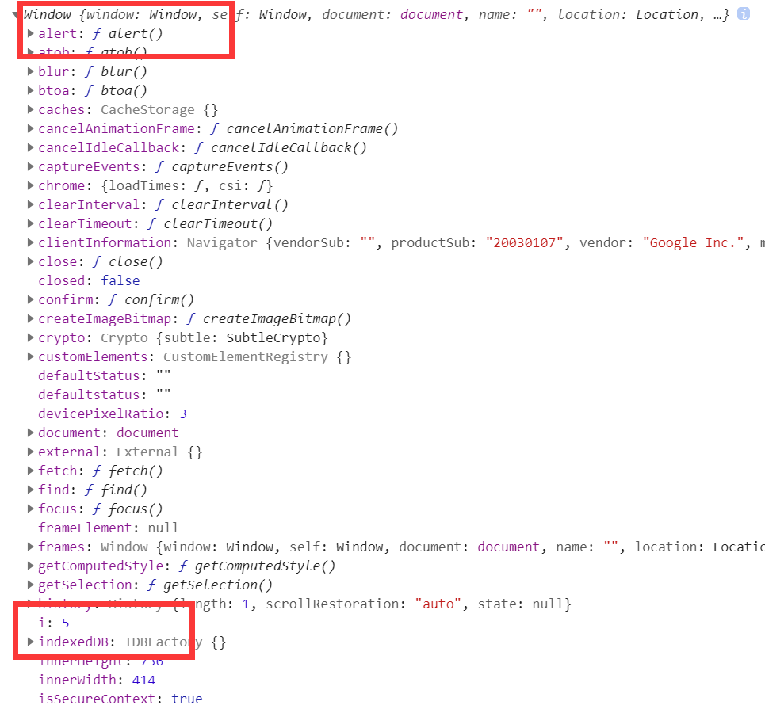

# 🍃 JavaScript Tricks

## && 与 ||

```js
let flag = false;
let res = flag || new Date()
console.log(res)//Wed Mar 16 2022 22:19:32 GMT+0800 (中国标准时间)

let flag2 = true;
let res2 = flag2 && "idea小时";
console.log(res2)//idea小时
```

如果||前面为false，则返回后者。

如果&&前面为true，则返回后者。


## var与let

```js
console.log(a)//undefined
var a=10;
```

```js
console.log(a)
let a=10;//Uncaught ReferenceError: Cannot access 'a' before initialization
```

var类型变量有个特性：**声明提升**。即不管var变量在哪里定义，都会在**当前代码块最开始的地方**声明它。所以在它被初始化之前，可以打印它，但是只能得到undefined。

但是let没有这个特性，所以它是一个错误。


```js
for (let i = 0; i < 5; i++) {
    
}
console.log(i)//Uncaught ReferenceError: i is not defined
```

```js
for (var i = 0; i < 5; i++) {
    
}
console.log(i)//5
```

let变量的作用域很明确，就是定义他的地方。在for循环之外就访问不到了。

而var变量又有一个特性，var定义的全局变量自动会绑定到全局对象window上。




## 任务队列

```js
for (var i = 0; i < 5; i++) {
    setTimeout(()=>{
        console.log(i)
    },0)
}//5 5 5 5 5 
```

即使设置了0ms（立即）执行console.log(i)，但最终还是打印了5。

因为JavaScript是单线程的，setTimeout这种行为，会将里面的函数放在一个任务队列里，JavaScript完成主线的代码之后，才会去执行任务队列里的任务。因此，当执行任务队列里的任务时，i循环增加到了5。

并且，setTimeout后面设置的毫秒数，是指：在多少ms之后，把里面的函数放进任务队列里，并不是立即执行，执行时间是不确定的。

又因为var是全局变量，所以打印5看起来很正常。


那么，把var改成let。

```js
for (let i = 0; i < 5; i++) {
    setTimeout(()=>{
        console.log(i)
    },0)
}//0 1 2 3 4
```

这时，又会打印0 1 2 3 4，这又是为啥？

这个涉及到闭包。

在  setTimeout( )函数中，我们写了个箭头函数，箭头函数中访问了在箭头函数外的作用域中的变量i，因此这个箭头函数就可以成为闭包。

而闭包的特性是，会一直拥有他引用的变量所在的词法作用域。

在这里，用let声明的i，每次循环都会创建一个闭包，闭包函数引用的i每一次循环都是不同的i，所以打印0 1 2 3 4。

而var声明的i，每次循环都会创建一个闭包，但是每个闭包函数引用的i是全局变量i，所以打印出来的结果是相同的.

区别就在于，var声明的i是在for循环外面，let是在for循环开始的时候。

有人可能会说，是不是你设置的时间太短了，你设置成1000ms，用let是不是也会打印5次5。

事实上，还是会打印0 1 2 3 4。和时间没有关系的，上面说过，这个时间只是将函数放进任务队列里的时间。

总结一句话：闭包函数会一直拥有其引用变量所在的词法作用域链。


## IIFE（立即调用函数表达式）

平时我们定义和执行函数分为两部分。

```js
function test(){
    console.log(2)
}
test();
```

使用IIFE（函数外面套个括号，然后再在后面加个括号）：会在定义的时候就执行函数

```js
(function test(){
    console.log(2)
})()
```


## 不要换行！

```js
function addTwo(x) {
    return x + 2;
}

function addThree(x) {
    return x + 3;
}

function addFive(x) {
    return x + 5;
}

function addTen(x) {
    return
    Promise.
    resolve(x).
    then(addTwo).
    then(addThree).
    then(addFive);
}
addTen(10).then(console.log);
```

IDE提示：Unreachable code

有问题吗？有问题。

js是对回车敏感的语言，**并不是靠分号来区分语句的**。所以这里本意是想让代码更美观，把return后面的内容换到了下一行，但是return独占一行就会直接返回了。

应该这么写：

```js
function addTen(x) {
    return Promise.
    resolve(x). 
    then(addTwo).
    then(addThree).
    then(addFive);
}
```

## Array.prototype.reduce() 挺好玩

```js
let res = [1, 2, 3, 4].reduce((pre, cur) => pre+cur, 10);
console.log(res)//20
//即10+1,11+2，13+3,16+4
```

此函数对数组里的元素进行循环。

reduce中接收两个参数，第一个参数是个函数（reducer函数），第二个参数是initialValue（可选的）。

如果不提供initialValue，那么循环将从第二个元素开始。

```js
let res = [1, 2, 3, 4].reduce((pre, cur) => pre+cur);
console.log(res)//10
//即1+2+3+4
```

如果提供了初始值，就相当于在数组前面添加了初始值。

reducer函数，接收四个参数：

pre:上一个reducer函数的返回值;（对于上面的例子，就是return pre+cur）

cur: 当前遍历到的元素。

curIndex:当前遍历到的元素的下标

arr：被遍历的对象

具体的解释在官方文档里有：[Array.prototype.reduce()](https://developer.mozilla.org/zh-CN/docs/Web/JavaScript/Reference/Global_Objects/Array/Reduce)


## 通用的合成期约函数

对于下面的代码，我只能说：js神奇！

reduce函数是一个循环处理的过程，循环一个数组，接收一个reducer回调函数，如果回调函数只有两个参数，那么第一个参数表示previousValue，第二个参数表示currentValue，回调函数中的返回值就是下一次操作的previousValue。

这里的previousValue就是promise，即promise.then(fn)执行后的返回值。

回调函数后面的promise.resolve(x)是initialValue（初始值），被当做循环的第一项，如果没有指定初始值，则会取数组的第一项当做initialValue，也就是说循环从第二个元素开始。

fn就表示数组中当前循环到的值。

```js
function addTwo(x) {
    return x + 2;
}

function addThree(x) {
    return x + 3;
}

function addFive(x) {
    return x + 5;
}

// function addTen(x) {
//     return Promise.resolve(x).then(addTwo).then(addThree).then(addFive);
// }

// addTen(10).then(console.log);

// function addTen2(x) {
//     return [addTwo, addThree, addFive]
//         .reduce((promise, fn) => promise.then(fn), Promise.resolve(x))
// }

function compose(...fns) {
    return (x) => fns.reduce((promise, fn) => promise.then(fn), Promise.resolve(x))
}

let addTen = compose(addTwo, addThree, addFive)
addTen(11).then(console.log)
```


## == 和 === 是不一样的

==比较的是值。类似于Java中的equals。

===不仅比较值，还得比较类型，类型不一致也不行。

通常IDE会推荐使用===，使用==会爆出警告。

Number（x）这种和直接声明一样。

```js
let a=3;
let b=new Number(3);
let c=3;
let d=Number(3);

console.log(a==b);//true
console.log(a===b);//false
console.log(a==c);//true
console.log(a===c);//true
console.log(a==d)//true
console.log(a===d)//true
console.log(b==d)//true
console.log(b===d)//false
```


