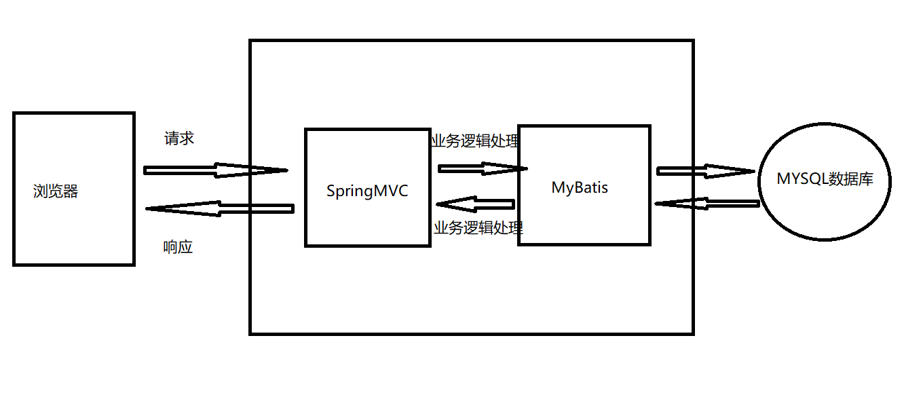

# 快速理解SSM三大流行框架

## 什么是`SSM`？

首先，SSM是**`Spring`+`SpringMVC`+`MyBatis`**的组合。

三者都是Java框架，什么是框架咱们先不谈，只知道有这三个东西。

## `Spring`、`SpringMVC`、`MyBatis`分别用来做什么的？

想知道他们做了什么，就需要先知道我们上网浏览网页时发生了什么？

1. 当你在地址栏输入网址，点击回车，浏览器就会发送一个`Request`（请求）到这个网址的服务器
2. 服务器接收到这个请求后，会根据你输入的信息，进行一系列的数据处理操作，生成最终结果。
3. 服务器把结果计算好，就会把这个结果返回给浏览器，浏览器就把结果显示在屏幕上。

> 💡 注意：这里的结果**并不一定**是单纯的1+1=2中的2，还有可能是一个包含页面布局、数据、外观的`HTML`文件。这个文件包含了`HTML`标签，`CSS`样式，`JS`函数等，浏览器只认识这三样东西，浏览器把这些东西翻译出来，就形成了我们看到的五颜六色、非常好看的网页。后者属于传统项目，也就是前后端不分离的项目。

> 🎉 前后端分离的项目，服务器只返回1+1=2中的2。常用的返回文件格式是`JSON`，这个后面再讲。现在不讲，免得搞混了。
>

## `SpringMVC`的作用

---

看懂上面的请求过程之后，SpringMVC的作用就可以总结出来了。

>
> 📌 SpringMVC的作用：**接收请求`Request`，把请求交给负责处理这个请求的“人”，请求中所包含的信息都交给这个人，至于这个人再找谁去处理数据，就另说了。反正数据处理好之后，`SpringMVC`把这个人处理好的数据返回`Response`给请求者。**
>

## 为什么叫框架？

> 👋 所有**框架**的出现都只有一个原因： 在这个框架出现之前，你要写大量的**重复性代码**。把这一堆重复性的代码给提取出来，只写一份，让更多的人拿来就用，拿来接着写，这，就是**框架**。	

**更形象更准确的说法**应该是这样的：

下面的房屋架子就是框架。房屋架子都给你搭好了，你只需要上混凝土、装修就行了，就可以住人了，伟大的工程就完成了。一个项目就完成了。

😜 房屋架子就是框架替你写好的代码，你的混凝土、装修就是你自己写的代码。用了框架，工作量就少了很多，而且人家搭的架子肯定比你自己搭的好。

## **`MyBatis`**的作用

再来说说**`MyBatis`**，读音：麦-白提丝。

他是一个**`持久层框架`**，持久层就是和数据库打交道的层，说白了，“持久”是英语翻译过来的，他是一个动词，是个过程，把数据**持久化**到数据库，就是`增删改查`。

他的出现，让你不用再写数据库连接相关的代码。你需要在代码中写SQL，交给MyBatis，他就可以正确地执行SQL，并返回结果。

## `Spring`的作用

我们通常所指的Spring就是指单独的Spring框架，有的时候有的人会说”Spring全家桶“，这个时候的Spring是指Spring系列下的一些框架，比如`SpringSecurity`（安全相关）、`SpringData`（数据库相关）。

Spring框架是一个容器（`Container`），听着挺高级的，实际上就是个盛东西的，里面盛的是`Bean`。

### `Bean`是个什么东西

Bean的定义太复杂。简单来说，就是对象，就是程序中干活的“人”。

处理请求的Controller就是Bean。负责数据库增删改查的Mapper也是Bean。服务层的Service也是Bean。

反正干活的就是Bean。**Bean也就是个对象**。

### **为什么要用容器盛着`Bean`**？

如果我想让这个人干活就需要调用它的方法，bean.doSomeWork()；首先得实例化Bean，也就是`People p=new People()`。一个项目中需要大量的Bean，这些Bean在项目的各个地方都可能用到。你用的时候就需要new一个，不用的时候他就没了，下次再用还得再创建。这样的方式显然很蠢，所以出现了容器这个管理者，他掌管着Bean的生死（生命周期）。

>
> 📘 通过查看**Spring的源码**可以得知，Spring容器本质是一个`Map`，Map中`key`是Bean的“名字”，`value`是这个Bean对象。通过查询Bean的名字，就可以得到这个Bean对象，需要的时候从Map中`get`取出来用就可以了。
>

## 小结

通过上面的分析，简单总结下三者的作用。

✅ `SpringMVC`用来接收请求，返回响应数据。

✅ `Spring`用来管理Bean对象的生命周期。

✅ `MyBatis`用来处理数据库相关操作。

这三个框架是最基础的框架，有了他们，就可以搭建起一个简单的WEB项目了。

## 提问

1. 必须用这三个框架才能写WEB项目吗?

      当然不是，MyBatis就可以用`Hibernate`来代替，也就是常说的`SSH`。框架只是一种产品，Spring系列提供的Spring、SpringMVC好用，用的人多，所以提到Java项目就立马想到`SSM`。实际上还有特别多的框架可供选择，具体还得看公司用什么。

1. 知道这些就算懂了这三大框架吗？
   
    `Definitely not`.三大框架本身涵盖了很多东西，这都是很多大佬的心血，不可能也不需要完全搞明白这些框架。（如果Java面试哪天卷到手撕SSM的阶段，请当我没说😅。）框架上手写代码很容易，熟练使用也只需要一段时间，掌握他们的原理后，面对新出现的框架才能更快上手，最终学习他们的编程思想才是最重要的。加油吧，骚年！
    

## 感谢

感谢每一位小伙伴的支持，感谢每一颗❤️。觉得有帮助，请点赞转发关注支持一下！

有任何疑问都可以留言公众号（idea小时），看到消息我会第一时间回复。对于问的多的问题，我会出文章解答的！

