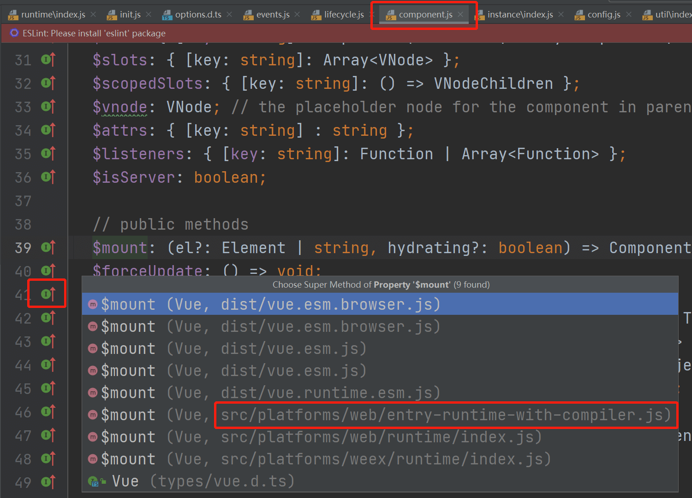

# 🍎 Vue源码解析

本文是参考github上的一个项目来写的，有很多地方别人写的很好了，我就直接复制粘贴过来了。也有很多我自己理解的部分。

主要是为了快速学习，做下记录。

[参考的Github项目地址](https://github.com/ustbhuangyi/vue-analysis)

## Flow静态类型检查

为保证编译时期的代码正确性，Vue用Flow做类型检查，包括类型推断和类型注释。

> 因为 Babel 和 ESLint 都有对应的 Flow 插件以支持语法，可以完全沿用现有的构建配置，非常小成本的改动就可以拥有静态类型检查的能力。             

### 类型推断

不需要其他代码就能根据变量使用的上下文来判断变量应该的类型。

```js
/*@flow*/

function split(str) {
  return str.split(' ')
}

split(11)
```

### 类型注释

在参数的后面加个冒号，冒号后面跟着希望该变量是什么类型。

示例：

```js
/*@flow*/

function add(x: number, y: number): number {
  return x + y
}

add('Hello', 11)
```

数组<>里是泛型T。

```js
/*@flow*/

var arr: Array<number> = [1, 2, 3]

arr.push('Hello')
```

"|"这个符号表示或者

```js
/*@flow*/

class Bar {
  x: string;           // x 是字符串
  y: string | number;  // y 可以是字符串或者数字
  z: boolean;

  constructor(x: string, y: string | number) {
    this.x = x
    this.y = y
    this.z = false
  }
}

var bar: Bar = new Bar('hello', 4)

var obj: { a: string, b: number, c: Array<string>, d: Bar } = {
  a: 'hello',
  b: 11,
  c: ['hello', 'world'],
  d: new Bar('hello', 3)
}

```


```js
/*@flow*/

var foo: ?string = null
```

此时，`foo` 可以为字符串，也可以为 `null`。


### Flow 在 Vue.js 源码中的应用

有时候我们想引用第三方库，或者自定义一些类型，但 Flow 并不认识，因此检查的时候会报错。为了解决这类问题，Flow 提出了一个 `libdef` 的概念，可以用来识别这些第三方库或者是自定义类型，而 Vue.js 也利用了这一特性。

在 Vue.js 的主目录下有 `.flowconfig` 文件， 它是 Flow 的配置文件，感兴趣的同学可以看[官方文档](https://flow.org/en/docs/config/)。这其中的 `[libs]` 部分用来描述包含指定库定义的目录，默认是名为 `flow-typed` 的目录。

这里 `[libs]` 配置的是 `flow`，表示指定的库定义都在 `flow` 文件夹内。我们打开这个目录，会发现文件如下：

```
flow
├── compiler.js        # 编译相关
├── component.js       # 组件数据结构
├── global-api.js      # Global API 结构
├── modules.js         # 第三方库定义
├── options.js         # 选项相关
├── ssr.js             # 服务端渲染相关
├── vnode.js           # 虚拟 node 相关
```

可以看到，Vue.js 有很多自定义类型的定义，在阅读源码的时候，如果遇到某个类型并想了解它完整的数据结构的时候，可以回来翻阅这些数据结构的定义。


## 目录设计

Vue.js 的源码都在 src 目录下，其目录结构如下。

```
src
├── compiler        # 编译相关 
├── core            # 核心代码 
├── platforms       # 不同平台的支持
├── server          # 服务端渲染
├── sfc             # .vue 文件解析
├── shared          # 共享代码
```

## Vue源码构建

Vue.js 源码是基于 [Rollup](https://github.com/rollup/rollup) 构建的，它的构建相关配置都在 scripts 目录下。

### 构建脚本

基于 NPM 托管的项目都有一个 package.json 文件，项目的描述文件，它的内容是一个标准的 JSON 对象。

我们通常会配置 `script` 字段作为 NPM 的执行脚本，Vue.js 源码构建的脚本如下：

```json
{
  "script": {
    "build": "node scripts/build.js",
    "build:ssr": "npm run build -- web-runtime-cjs,web-server-renderer",
    "build:weex": "npm run build -- weex"
  }
}
 
```

这里总共有 3 条命令，作用都是构建 Vue.js，后面 2 条是在第一条命令的基础上，添加一些环境参数。

当在命令行运行 `npm run build` 的时候，实际上就会执行 `node scripts/build.js`，接下来我们来看看它实际是怎么构建的。

### 构建过程

打开构建的入口 JS 文件，在 `scripts/build.js` 中：

```js
let builds = require('./config').getAllBuilds()

// filter builds via command line arg
if (process.argv[2]) {
  const filters = process.argv[2].split(',')
  builds = builds.filter(b => {
    return filters.some(f => b.output.file.indexOf(f) > -1 || b._name.indexOf(f) > -1)
  })
} else {
  // filter out weex builds by default
  builds = builds.filter(b => {
    return b.output.file.indexOf('weex') === -1
  })
}

build(builds)
```

这段代码逻辑非常简单，先从配置文件读取配置，再通过命令行参数对构建配置做过滤，这样就可以构建出不同用途的 Vue.js 了。接下来我们看一下配置文件，在 `scripts/config.js` 中：

```js
const builds = {
  // Runtime only (CommonJS). Used by bundlers e.g. Webpack & Browserify
  'web-runtime-cjs': {
    entry: resolve('web/entry-runtime.js'),
    dest: resolve('dist/vue.runtime.common.js'),
    format: 'cjs',
    banner
  },
  // Runtime+compiler CommonJS build (CommonJS)
  'web-full-cjs': {
    entry: resolve('web/entry-runtime-with-compiler.js'),
    dest: resolve('dist/vue.common.js'),
    format: 'cjs',
    alias: { he: './entity-decoder' },
    banner
  },
  // Runtime only (ES Modules). Used by bundlers that support ES Modules,
  // e.g. Rollup & Webpack 2
  'web-runtime-esm': {
    entry: resolve('web/entry-runtime.js'),
    dest: resolve('dist/vue.runtime.esm.js'),
    format: 'es',
    banner
  },
  // Runtime+compiler CommonJS build (ES Modules)
  'web-full-esm': {
    entry: resolve('web/entry-runtime-with-compiler.js'),
    dest: resolve('dist/vue.esm.js'),
    format: 'es',
    alias: { he: './entity-decoder' },
    banner
  },
  // runtime-only build (Browser)
  'web-runtime-dev': {
    entry: resolve('web/entry-runtime.js'),
    dest: resolve('dist/vue.runtime.js'),
    format: 'umd',
    env: 'development',
    banner
  },
  // runtime-only production build (Browser)
  'web-runtime-prod': {
    entry: resolve('web/entry-runtime.js'),
    dest: resolve('dist/vue.runtime.min.js'),
    format: 'umd',
    env: 'production',
    banner
  },
  // Runtime+compiler development build (Browser)
  'web-full-dev': {
    entry: resolve('web/entry-runtime-with-compiler.js'),
    dest: resolve('dist/vue.js'),
    format: 'umd',
    env: 'development',
    alias: { he: './entity-decoder' },
    banner
  },
  // Runtime+compiler production build  (Browser)
  'web-full-prod': {
    entry: resolve('web/entry-runtime-with-compiler.js'),
    dest: resolve('dist/vue.min.js'),
    format: 'umd',
    env: 'production',
    alias: { he: './entity-decoder' },
    banner
  },
  // ...
}
```

对于单个配置，它是遵循 Rollup 的构建规则的。其中 `entry` 属性表示构建的入口 JS 文件地址，`dest` 属性表示构建后的 JS 文件地址。`format` 属性表示构建的格式，`cjs` 表示构建出来的文件遵循 [CommonJS](http://wiki.commonjs.org/wiki/Modules/1.1) 规范，`es` 表示构建出来的文件遵循 [ES Module](http://exploringjs.com/es6/ch_modules.html) 规范。 `umd` 表示构建出来的文件遵循 [UMD](https://github.com/umdjs/umd) 规范。

以 `web-runtime-cjs` 配置为例，它的 `entry` 是
`resolve('web/entry-runtime.js')`，先来看一下 `resolve` 函数的定义。

源码目录：`scripts/config.js`

```js
const aliases = require('./alias')
const resolve = p => {
  const base = p.split('/')[0]
  if (aliases[base]) {
    return path.resolve(aliases[base], p.slice(base.length + 1))
  } else {
    return path.resolve(__dirname, '../', p)
  }
}
```

这里的 `resolve` 函数实现非常简单，它先把 `resolve` 函数传入的参数 `p` 通过 `/` 做了分割成数组，然后取数组第一个元素设置为 `base`。在我们这个例子中，参数 `p` 是 `web/entry-runtime.js`，那么 `base` 则为 `web`。`base` 并不是实际的路径，它的真实路径借助了别名的配置，我们来看一下别名配置的代码，在 `scripts/alias` 中：

```js
const path = require('path')

module.exports = {
  vue: path.resolve(__dirname, '../src/platforms/web/entry-runtime-with-compiler'),
  compiler: path.resolve(__dirname, '../src/compiler'),
  core: path.resolve(__dirname, '../src/core'),
  shared: path.resolve(__dirname, '../src/shared'),
  web: path.resolve(__dirname, '../src/platforms/web'),
  weex: path.resolve(__dirname, '../src/platforms/weex'),
  server: path.resolve(__dirname, '../src/server'),
  entries: path.resolve(__dirname, '../src/entries'),
  sfc: path.resolve(__dirname, '../src/sfc')
}
```

很显然，这里 `web` 对应的真实的路径是 `path.resolve(__dirname, '../src/platforms/web')`，这个路径就找到了 Vue.js 源码的 web 目录。然后 `resolve` 函数通过 `path.resolve(aliases[base], p.slice(base.length + 1))` 找到了最终路径，它就是 Vue.js 源码 web 目录下的 `entry-runtime.js`。因此，`web-runtime-cjs` 配置对应的入口文件就找到了。

它经过 Rollup 的构建打包后，最终会在 dist 目录下生成 `vue.runtime.common.js`。

### Runtime Only VS Runtime + Compiler 

- Runtime Only

我们在使用 Runtime Only 版本的 Vue.js 的时候，通常需要借助如 webpack 的 vue-loader 工具把 .vue 文件编译成 JavaScript，因为是在编译阶段做的，所以它只包含运行时的 Vue.js 代码，因此代码体积也会更轻量。

- Runtime + Compiler

我们如果没有对代码做预编译，但又使用了 Vue 的 template 属性并传入一个字符串，则需要在客户端编译模板，如下所示：

```js
// 需要编译器的版本
new Vue({
  template: '<div>{{ hi }}</div>'
})

// 这种情况不需要
new Vue({
  render (h) {
    return h('div', this.hi)
  }
})
```

因为在 Vue.js 2.0 中，最终渲染都是通过 `render` 函数，如果写 `template` 属性，则需要编译成 `render` 函数，那么这个编译过程会发生运行时，所以需要带有编译器的版本。

很显然，这个编译过程对性能会有一定损耗，所以通常我们更推荐使用 Runtime-Only 的 Vue.js。

## Vue的入口

分析 Runtime + Compiler 构建出来的 Vue.js，它的入口是 `src/platforms/web/entry-runtime-with-compiler.js`：

```js
import Vue from './runtime/index'
```

其中，Vue是从这里导入的。

去找`'./runtime/index'`,它定义在 `src/platforms/web/runtime/index.js` 中：

```js
import Vue from 'core/index'
```

接着去找这个Vue，看一下真正初始化 Vue 的地方，在 `src/core/index.js` 中：

```js
import Vue from './instance/index'
import { initGlobalAPI } from './global-api/index'
import { isServerRendering } from 'core/util/env'
import { FunctionalRenderContext } from 'core/vdom/create-functional-component'

initGlobalAPI(Vue)

Object.defineProperty(Vue.prototype, '$isServer', {
  get: isServerRendering
})

Object.defineProperty(Vue.prototype, '$ssrContext', {
  get () {
    /* istanbul ignore next */
    return this.$vnode && this.$vnode.ssrContext
  }
})

// expose FunctionalRenderContext for ssr runtime helper installation
Object.defineProperty(Vue, 'FunctionalRenderContext', {
  value: FunctionalRenderContext
})

Vue.version = '__VERSION__'

export default Vue
```

这里有 2 处关键的代码，`import Vue from './instance/index'` 和 `initGlobalAPI(Vue)`，初始化全局 Vue API（我们稍后介绍），我们先来看第一部分，在 `src/core/instance/index.js` 中：

### Vue 的定义

```js
import { initMixin } from './init'
import { stateMixin } from './state'
import { renderMixin } from './render'
import { eventsMixin } from './events'
import { lifecycleMixin } from './lifecycle'
import { warn } from '../util/index'

function Vue (options) {
  if (process.env.NODE_ENV !== 'production' &&
    !(this instanceof Vue)
  ) {
    warn('Vue is a constructor and should be called with the `new` keyword')
  }
  this._init(options)
}

initMixin(Vue)
stateMixin(Vue)
eventsMixin(Vue)
lifecycleMixin(Vue)
renderMixin(Vue)

export default Vue	
```

这就是Vue的庐山真面目，其实就是一个**用Function实现的类**，我们只能通过new Vue去实例化。

> :confused: 有些同学看到这不禁想问，为何 Vue 不用 ES6 的 Class 去实现呢？我们往后看这里有很多 ```xxxMixin``` 的函数调用，并把 `Vue` 当参数传入，它们的功能都是给 Vue 的 prototype 上扩展一些方法（这里具体的细节会在之后的文章介绍，这里不展开），Vue 按功能把这些扩展分散到多个模块中去实现，而不是在一个模块里实现所有，这种方式是用 Class 难以实现的。这么做的好处是非常方便代码的维护和管理，这种编程技巧也非常值得我们去学习。


### 初始化全局API

Vue.js 在整个初始化过程中，除了给它的原型 prototype 上扩展方法，还会给 `Vue` 这个对象本身扩展全局的静态方法，它的定义在 `src/core/global-api/index.js` 中：

```js
export function initGlobalAPI (Vue: GlobalAPI) {
  // config
  const configDef = {}
  configDef.get = () => config
  if (process.env.NODE_ENV !== 'production') {
    configDef.set = () => {
      warn(
        'Do not replace the Vue.config object, set individual fields instead.'
      )
    }
  }
  Object.defineProperty(Vue, 'config', configDef)

  // exposed util methods.
  // NOTE: these are not considered part of the public API - avoid relying on
  // them unless you are aware of the risk.
  Vue.util = {
    warn,
    extend,
    mergeOptions,
    defineReactive
  }

  Vue.set = set
  Vue.delete = del
  Vue.nextTick = nextTick

  Vue.options = Object.create(null)
  ASSET_TYPES.forEach(type => {
    Vue.options[type + 's'] = Object.create(null)
  })

  // this is used to identify the "base" constructor to extend all plain-object
  // components with in Weex's multi-instance scenarios.
  Vue.options._base = Vue

  extend(Vue.options.components, builtInComponents)

  initUse(Vue)
  initMixin(Vue)
  initExtend(Vue)
  initAssetRegisters(Vue)
}
```

> :smile: [Vue官方指南中的那些全局API](https://cn.vuejs.org/v2/api/#全局-API)，这里面的东西之前一直不会用，现在可以看源代码了。

1. [Vue.extend](https://cn.vuejs.org/v2/api/#Vue-extend)
2. [Vue.nextTick](https://cn.vuejs.org/v2/api/#Vue-nextTick)
3. [Vue.set](https://cn.vuejs.org/v2/api/#Vue-set)
4. [Vue.delete](https://cn.vuejs.org/v2/api/#Vue-delete)
5. [Vue.directive](https://cn.vuejs.org/v2/api/#Vue-directive)
6. [Vue.filter](https://cn.vuejs.org/v2/api/#Vue-filter)
7. [Vue.component](https://cn.vuejs.org/v2/api/#Vue-component)
8. [Vue.use](https://cn.vuejs.org/v2/api/#Vue-use)
9. [Vue.mixin](https://cn.vuejs.org/v2/api/#Vue-mixin)
10. [Vue.compile](https://cn.vuejs.org/v2/api/#Vue-compile)
11. [Vue.observable](https://cn.vuejs.org/v2/api/#Vue-observable)
12. [Vue.version](https://cn.vuejs.org/v2/api/#Vue-version)

> :warning: 有一点要注意的是，`Vue.util` 暴露的方法最好不要依赖，因为它可能经常会发生变化，是不稳定的。


## 数据驱动

Vue.js 一个核心思想是数据驱动。所谓数据驱动，是指视图是由数据驱动生成的，我们对视图的修改，不会直接操作 DOM，而是通过修改数据，即**数据驱动视图**。

在 Vue.js 中我们可以采用简洁的模板语法来声明式的将数据渲染为 DOM：

```html
<div id="app">
  {{ message }}
</div>
var app = new Vue({
  el: '#app',
  data: {
    message: 'Hello Vue!'
  }
})
```

### 看看new Vue的时候发生了什么

来看一下源码，在`src/core/instance/index.js` 中。

```js
function Vue (options) {
  if (process.env.NODE_ENV !== 'production' &&
    !(this instanceof Vue)
  ) {
    warn('Vue is a constructor and should be called with the `new` keyword')
  }
  this._init(options)
}
```

可以看到 `Vue` 只能通过 new 关键字初始化，然后会调用 `this._init` 方法， 该方法在 `src/core/instance/init.js` 中定义。

> :bulb: $options中的$符号并不是什么语法和关键字，而是为了让用户区分vue中的变量和用户自定义的变量而已，只是加了个前缀字符，加$为了表示特殊含义。

> :star2: **\`vue-perf-start:${vm._uid}\`**是插值表达式，配合${XXX}，取到XXX变量的值，注意两侧有\`\`号。

> :tada:
>
> #### ES6中
>
> es6中也可以采用${XXX}来在字符串中插入变量（这个记住要利用v-bind）
>
> ##### jquery中
>
> 利用$作为选择器，其实是jquery库对原生JavaScript对选择元素进行的一种封装！
>
> #### devtool中
>
> $是在`console`中是冗长的函数`document.querySelector`的一个别名

```js
Vue.prototype._init = function (options?: Object) {
  const vm: Component = this
  // a uid
  vm._uid = uid++

  let startTag, endTag
  /* istanbul ignore if */
  if (process.env.NODE_ENV !== 'production' && config.performance && mark) {
    startTag = `vue-perf-start:${vm._uid}`
    endTag = `vue-perf-end:${vm._uid}`
    mark(startTag)
  }

  // a flag to avoid this being observed
  vm._isVue = true
  // merge options
  if (options && options._isComponent) {
    // optimize internal component instantiation
    // since dynamic options merging is pretty slow, and none of the
    // internal component options needs special treatment.
    initInternalComponent(vm, options)
  } else {
    vm.$options = mergeOptions(
      resolveConstructorOptions(vm.constructor),
      options || {},
      vm
    )
  }
  /* istanbul ignore else */
  if (process.env.NODE_ENV !== 'production') {
    initProxy(vm)
  } else {
    vm._renderProxy = vm
  }
  // expose real self
  vm._self = vm
  initLifecycle(vm)
  initEvents(vm)
  initRender(vm)
  callHook(vm, 'beforeCreate')
  initInjections(vm) // resolve injections before data/props
  initState(vm)
  initProvide(vm) // resolve provide after data/props
  callHook(vm, 'created')

  /* istanbul ignore if */
  if (process.env.NODE_ENV !== 'production' && config.performance && mark) {
    vm._name = formatComponentName(vm, false)
    mark(endTag)
    measure(`vue ${vm._name} init`, startTag, endTag)
  }

  if (vm.$options.el) {
    vm.$mount(vm.$options.el)
  }
}
```

Vue 初始化主要就干了几件事情，合并配置，初始化生命周期，初始化事件中心，初始化渲染，初始化 data、props、computed、watcher 等等。

由于我们这一章的目标是弄清楚模板和数据如何渲染成最终的 DOM，所以各种初始化逻辑我们先不看。在初始化的最后，检测到如果有 `el` 属性，则调用 `vm.$mount` 方法挂载 `vm`，挂载的目标就是把模板渲染成最终的 DOM，那么接下来我们来分析 Vue 的挂载过程。

## Vue实例挂载

Vue 中我们是通过 `$mount` 实例方法去挂载 `vm` 的，`$mount` 方法在多个文件中都有定义。



先来看一下 `src/platform/web/entry-runtime-with-compiler.js` 文件中定义：

其中，Vue不能被挂载到html标签和body标签上就是在这里限制的。

```js
  /* istanbul ignore if */
  if (el === document.body || el === document.documentElement) {
    process.env.NODE_ENV !== 'production' && warn(
      `Do not mount Vue to <html> or <body> - mount to normal elements instead.`
    )
    return this
  }
```

这里，先暂存了一下Vue原型上的$mount方法，并重新定义了$mount方法，最终，调用了原来的$mount方法。

原先原型上的 `$mount` 方法在 `src/platform/web/runtime/index.js` 中定义，之所以这么设计完全是为了复用，因为它是可以被 `runtime only` 版本的 Vue 直接使用的。

如果$options中没有定义render方法，那么则会把el或template转换成render方法。

> :bulb: 这里我们要牢记，在 Vue 2.0 版本中，所有 Vue 的组件的渲染最终都需要 `render` 方法，无论我们是用单文件 .vue 方式开发组件，还是写了 `el` 或者 `template` 属性，最终都会转换成 `render` 方法，那么这个过程是 Vue 的一个“在线编译”的过程，它是调用 `compileToFunctions` 方法实现的。

```js
const mount = Vue.prototype.$mount
Vue.prototype.$mount = function (
  el?: string | Element,
  hydrating?: boolean
): Component {
  el = el && query(el)

  /* istanbul ignore if */
  if (el === document.body || el === document.documentElement) {
    process.env.NODE_ENV !== 'production' && warn(
      `Do not mount Vue to <html> or <body> - mount to normal elements instead.`
    )
    return this
  }

  const options = this.$options
  // resolve template/el and convert to render function
  if (!options.render) {
    let template = options.template
    if (template) {
      if (typeof template === 'string') {
        if (template.charAt(0) === '#') {
          template = idToTemplate(template)
          /* istanbul ignore if */
          if (process.env.NODE_ENV !== 'production' && !template) {
            warn(
              `Template element not found or is empty: ${options.template}`,
              this
            )
          }
        }
      } else if (template.nodeType) {
        template = template.innerHTML
      } else {
        if (process.env.NODE_ENV !== 'production') {
          warn('invalid template option:' + template, this)
        }
        return this
      }
    } else if (el) {
      template = getOuterHTML(el)
    }
    if (template) {
      /* istanbul ignore if */
      if (process.env.NODE_ENV !== 'production' && config.performance && mark) {
        mark('compile')
      }

      const { render, staticRenderFns } = compileToFunctions(template, {
        outputSourceRange: process.env.NODE_ENV !== 'production',
        shouldDecodeNewlines,
        shouldDecodeNewlinesForHref,
        delimiters: options.delimiters,
        comments: options.comments
      }, this)
      options.render = render
      options.staticRenderFns = staticRenderFns

      /* istanbul ignore if */
      if (process.env.NODE_ENV !== 'production' && config.performance && mark) {
        mark('compile end')
        measure(`vue ${this._name} compile`, 'compile', 'compile end')
      }
    }
  }
  return mount.call(this, el, hydrating)
}
```

### 原先定义在原型上的$mount方法

```js
// public mount method
Vue.prototype.$mount = function (
  el?: string | Element,
  hydrating?: boolean
): Component {
  el = el && inBrowser ? query(el) : undefined
  return mountComponent(this, el, hydrating)
}
```

`$mount` 方法支持传入 2 个参数，第一个是 `el`，它表示挂载的元素，可以是字符串，也可以是 DOM 对象，如果是字符串在浏览器环境下会调用 `query` 方法转换成 DOM 对象的。第二个参数是和服务端渲染相关，在浏览器环境下我们不需要传第二个参数。

`$mount` 方法实际上会去调用 `mountComponent` 方法，这个方法定义在 `src/core/instance/lifecycle.js` 文件中：

```js
export function mountComponent (
  vm: Component,
  el: ?Element,
  hydrating?: boolean
): Component {
  vm.$el = el
  if (!vm.$options.render) {
    vm.$options.render = createEmptyVNode
    if (process.env.NODE_ENV !== 'production') {
      /* istanbul ignore if */
      if ((vm.$options.template && vm.$options.template.charAt(0) !== '#') ||
        vm.$options.el || el) {
        warn(
          'You are using the runtime-only build of Vue where the template ' +
          'compiler is not available. Either pre-compile the templates into ' +
          'render functions, or use the compiler-included build.',
          vm
        )
      } else {
        warn(
          'Failed to mount component: template or render function not defined.',
          vm
        )
      }
    }
  }
  callHook(vm, 'beforeMount')

  let updateComponent
  /* istanbul ignore if */
  if (process.env.NODE_ENV !== 'production' && config.performance && mark) {
    updateComponent = () => {
      const name = vm._name
      const id = vm._uid
      const startTag = `vue-perf-start:${id}`
      const endTag = `vue-perf-end:${id}`

      mark(startTag)
      const vnode = vm._render()
      mark(endTag)
      measure(`vue ${name} render`, startTag, endTag)

      mark(startTag)
      vm._update(vnode, hydrating)
      mark(endTag)
      measure(`vue ${name} patch`, startTag, endTag)
    }
  } else {
    updateComponent = () => {
      vm._update(vm._render(), hydrating)
    }
  }

  // we set this to vm._watcher inside the watcher's constructor
  // since the watcher's initial patch may call $forceUpdate (e.g. inside child
  // component's mounted hook), which relies on vm._watcher being already defined
  new Watcher(vm, updateComponent, noop, {
    before () {
      if (vm._isMounted) {
        callHook(vm, 'beforeUpdate')
      }
    }
  }, true /* isRenderWatcher */)
  hydrating = false

  // manually mounted instance, call mounted on self
  // mounted is called for render-created child components in its inserted hook
  if (vm.$vnode == null) {
    vm._isMounted = true
    callHook(vm, 'mounted')
  }
  return vm
}
```


